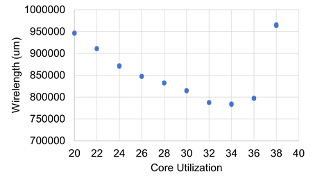
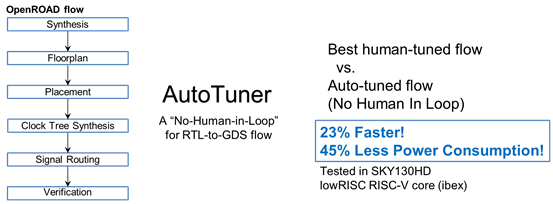

# 开源EDA工具OpenROAD介绍和应用

| **学**  **号：** **23112020049** |
| :------------------------------- |
| **姓**  **名：**   **朱凯翔**    |
| **学**  **院：**  **微电子学院** |
| **专**  **业：电子科学与技术**   |

## 目录

[一、选题原因... 2](#_Toc149728069)

[二、OpenROAD简介... 3](#_Toc149728070)

[三、进行Layout生成的工具... 6](#_Toc149728071)

[3.1 逻辑综合 Logic Synthesis. 6](#_Toc149728072)

[3.2 布局设计和电源分配网络 Floorplan and early power delivery network. 7](#_Toc149728073)

[3.3 布局和电源分配网络细化 Placement and PDN refinement. 8](#_Toc149728074)

[3.4 时钟树综合 Clock Tree Synthesis. 10](#_Toc149728075)

[3.5 全局布线 Global routing. 10](#_Toc149728076)

[3.6 详细布线 Detailed Routing. 11](#_Toc149728077)

[3.7 静态时序分析 Static Timing Analysis. 11](#_Toc149728078)

[3.8 寄生参数提取 Parasitic Extraction. 12](#_Toc149728079)

[3.9工具演变... 13](#_Toc149728080)

[3.10设计数据库 OpenDB. 14](#_Toc149728081)

[四、Metrics 2.1. 15](#_Toc149728082)

[4.1 Metrics 2.1 结构... 16](#_Toc149728083)

[4.2 Metrics 2.1在机器学习中的应用... 19](#_Toc149728084)

[4.3 Metrics 2.1应用实例... 20](#_Toc149728085)

[五、自动调参工具AutoTuner 22](#_Toc149728086)

[六、OpenROAD流程使用... 24](#_Toc149728087)

[运行... 29](#_Toc149728088)

[结果查看... 29](#_Toc149728089)

[AutoTuner 31](#_Toc149728090)

[七、总结... 34](#_Toc149728091)

[参考资料... 36](#_Toc149728092)

## 一、选题原因

​    开源EDA是目前的一个研究热门领域，与商用EDA相比，开源EDA工具具有低成本、可定制化、自由度高等优点，但同样开源EDA工具可能功能较为简单，性能不如商用工具出色。但开源EDA在逐渐建议一个庞大的开源社区，通过共享知识、开发代码来推动开源EDA工具的发展，开源EDA工具在教育和研究领域也得到了广泛的应用，在我们的日常科研中经常会涉及到开源EDA工具的使用。此外经过不断的迭代优化，一些开源EDA工具的性能也在一些方面与商用EDA工具相媲美。OpenROAD是一个新兴的开源EDA工具流程，开源实现一个端到端的工具流程，覆盖从逻辑综合到物理设计的整个IC设计流程，功能丰富，让我很感兴趣，因此我选择了OpenROAD作为我期中报告的主题。

​    此外，我们都知道ASIC设计是困难的、昂贵的和有风险的。ASIC设计的EDA工具有成千上万的命令选项组合，这带来了很高的成本和很大的风险，削弱了创新。并且随着工艺节点的进步，芯片设计的成本开始越来越超过摩尔定律。此外，与FPGA的EDA工具不同，赛灵思等FPGA厂商开源了一部分商业EDA工具开源版本。而ASIC的EDA工具很少有开源版本，或者开源版本的性能相较于商业版本差之甚远。为了克服上述的限制，跟上摩尔定律下的 SoC 指数级增长的复杂性，DARPA IDEA 计划旨在开发一个全自动的，“no human in the loop” 电路版图生成器。与商用EDA不同，OpenROAD注重易用性和运行时。为了解决设计周期的问题，OpenROAD的目标是在24小时内完成RTL到GDS版图的生成，并且希望实现人在回路外，整个流程完全使用开源工具。它几乎零成本的实现了系统和设计创新，并且可以针对系统和应用定制化。


图 1 芯片设计成本随工艺节点的变化

## 二、OpenROAD简介

​    OpenROAD是Foundations and Realization of Open, Accessible Design的缩写，可以看出OpenROAD的核心就是开放开源，它集成了一系列EDA开发工具，实现了由RTL到GDS的开发，实现使用RTL Verilog，sdc约束文件，lib库文件和lef文件作为输入，生成一个完整的GDS文件。包括逻辑综合（logic synthesis），底层布局（floorplan），（power delivery network），布局（placement），时钟树综合（clock synthesis），布线（routing）和（layout finishing）。OpenROAD消除了硬件设计中的成本，进度风险和不确定性障碍。可以实现快速低成本的IC设计，同时通过tcl脚本命令和python绑定的接口实现了灵活的流程控制。其中GDS 是 "Graphic Data System" 的缩写，它是一种电子设计自动化（EDA）领域中的文件格式，通常用于描述集成电路（IC）和其他电子设备的物理设计。GDS 文件包含了有关芯片的几何布局和版图的信息，包括晶体管、金属线、多层结构和其他元件的位置和连接。


图 2 OpenROAD中RTL-GDS流程

采用了多种方法来降低设计复杂性，包括使用极端分区策略，来降低运行时间；使用并行优化来提高每一个子任务的优化效果；同时基于机器学习的工具和流程结果的建模可以预测设计中所需的工具自动调整和设计适应性。最后通过版图生成的限制来降低设计复杂度。


图 3 OpenROAD中设计优化策略

OpenROAD还加入了AI相关内容，通过机器学习，来实现人在回路外（No human in loop）的芯片设计，并且在24小时内在不损失功耗性能面积（PPA）的情况下完成。OpenROAD还引入了Metrics2.1和AutoTuner来实现自动化的芯片设计。Metrics2.1提出了一个基于OpenROAD的跨工具用于可视化和机器学习应用的度量参数，用于衡量每一阶段的性能指标。AutoTuner是一个基于Metrics2.1的自动参数调整工具，可以将给定输入的参数组合按照预定的优化参数进行优化。

OpenROAD在研究和商业应用中已经得到了广泛的使用，包括Open Lane、Silicon Compiler、Hammer等。OpenROAD项目包括两个版本，OpenROAD应用程序和OpenROAD flow scripts。OpenROAD应用程序是一个独立的二进制文件，用于数字布局和布线，可供任何其他RTL-GDSII流程控制器使用，OpenROAD flow scripts由一组集成脚本组成，用于使用OpenROAD和其他开源工具进行自主的RTL-GDSII流程。

接下来我将逐一介绍OpenROAD中的工具。

## 三、进行Layout生成的工具

### 3.1 逻辑综合 Logic Synthesis

OpenROAD的逻辑综合部分是基于yosys所进行开发的，yosys支持将RTL级Verilog文件综合为门级网表。开源逻辑综合工具与商用工具相比其主要差距在于其对时序感知和优化的不足。OpenROAD为开源YOSYS/ABC综合工具带来了三个改进。第一，使用强化学习技术实现了面向时序的逻辑优化的自主设计空间探索。为了生成最佳的综合脚本，以调整到个体电路，OpenROAD开发了一个强化学习代理，自动生成逐步的综合脚本，以满足目标时序约束，并在最小化总面积的同时改善时序结果。第二，OpenROAD改进了ABC中的基本缓冲算法，通过将RePlAce布局工具整合到逻辑综合流程中，实现了物理感知的Buffer和门尺寸调整。如图所示，在这个过程中，基于全局布局的导线电容估计用于Buffer和门尺寸调整，以改善时序结果。第三，OpenROAD将综合流程中处理常用SDC命令的能力纳入其中。


图 4 OpenROAD中物理感知逻辑综合流程


图 5 OpenROAD中基于强化学习的逻辑综合优化

### 3.2 布局设计和电源分配网络 Floorplan and Early Power Delivery Network

OpenROAD中的布局设计和电源分配网络由TritonFPlan完成，它主要有两个组成部分，第一个是由RePlAce生成的混合尺寸（包括宏单元和标准单元）的全局布局启发的宏单元和输入IO布局。宏单元包装使用基于Parquet的模拟退火（SA）算法。SA使用宏单元布局的B*-树表示，其双目标优化是在最大化标准单元布局面积的同时最小化布线长度。SA解决方案根据顶层PDN的合法位置进行调整，同时考虑宏单元特定的边界和垂直/水平通道宽度等约束。原始混合尺寸全局布局生成了多个floorplan解决方案。TritonFPlan的第二个部分是为每个宏单元包装解决方案创建了一个满足DRC（设计规则检查）的PDN，采用了一种安全构建方法。金属和过渡结构的规则从用户指定的配置（config）文件中提取。使用RePlAce确定了这些floorplan（带有PDN）解决方案中总布线长度的最佳解。目前仅支持矩形floorplan设计。有关端点（endcap）、引脚调整单元（tapcell）和IO引脚的实现正在进行中。

 
### 3.3 布局和电源分配网络细化 Placement and PDN refinement

RePlAce [5] 是一种基于静电学类比的BSD开源解析式布局器。在 OpenROAD 中，RePlAce 用于以下几个方面：
- (i) 物理综合
- (ii) floorplan 设计期间的混合大小（宏单元和标准单元）布局
- (iii) 在给定 floorplan 内的标准单元布局
- (iv) 时钟树综合（CTS）期间的时钟缓冲合法化

RePlAce 是以时序驱动的，支持行业标准的 LEF/DEF、Verilog、SDC 和 Liberty 格式。

DEF (Design Exchange Format) 是一种 EDA 工具之间用于传输和交换芯片设计信息的标准文件格式。DEF 文件包含有关电子设计的物理和逻辑信息，如晶体管布局、布线、元件位置、连接等。它通常用于在不同的 EDA 工具之间传递设计数据，以便进行不同设计阶段的处理，例如布局、布线、静态时序分析等。DEF 文件的标准化使不同厂商的 EDA 工具能够更好地协同工作，并加速芯片设计流程。LEF (Library Exchange Format) 则是用于表示 IC 设计库信息的标准文件格式。LEF 文件通常包括有关标准单元、电路元件、电路库和其他相关信息的数据。LEF 文件允许芯片设计工程师在不同的 EDA 工具之间共享和重用标准单元库，以便更高效地进行电子设计自动化。LEF 文件通常与 DEF 文件一起使用，以确保在设计流程中准确描述和引用所需的标准单元库信息。

RePlAce 整合了以下组件：
- (i) FLUTE 用于估算 Steiner 线长度
- (ii) 用于寄生参数估算的快速 RC 估算器
- (iii) 用于布局期间的静态时序分析的 OpenSTA

RePlAce 应用了基于 OpenSTA 分析的信号网络重新加权迭代以改善时序。请注意，RePlAce 当前不会更改物理感知综合（LS）提供的网表，例如 buffer 或者尺寸。

在布局后，基于空间电流分布的改进估算，进一步细化 PDN。关键目标是实现 PDN 的单次通过、正确且安全的构建细化。floorplan 设计阶段的 PDN 是基于整个芯片上使用单一间距；布局后，此 PDN 会被选择性地去除一部分。芯片区域被分割成多个区域，对于每个区域，会选择一组去除一部分的 PDN 布线模板（参见上面提到的“config”文件）。这些模板是可拼接的，以便在相邻时遵循设计规则。PDN 工具以一组预定义的模板、设计的早期（floorplan 设计阶段）布放的 DEF 以及可用的功耗分析信息（例如 OpenSTA 工具可以提供基于实例的功耗报告）作为输入。然后，一个经过训练的卷积神经网络（CNN）为每个区域选择一个安全的模板。

### 3.4 时钟树综合 Clock Tree Synthesis

OpenROAD 中采用了 TritonCTS 来执行时钟树综合（CTS），用于实现低功耗、低偏差和低延迟的时钟分配，基于 K. Han, A. B. Kahng and J. Li 等人的 Optimal Generalized H-Tree Topology and Buffering for High-Performance and Low-Power Clock Distribution 中提出的 GH-Tree 范式。该算法使用动态规划找到具有最小估算功耗的时钟树拓扑结构，同时满足给定的延迟和偏差目标。从 Improved Flop Tray-Based Design Implementation for Power Reduction 中借鉴的容量 k 均值算法被调整用于执行接收器聚类。TritonCTS 与布局工具（RePlAce）有相关的接口，用于合法化插入的时钟缓冲器。

### 3.5 全局布线 Global routing

OpenROAD 全局布线使用了 UTD-BoxRouter，UTD-BoxRouter 是 BoxRouter 2.0 的改进版本，该工具读取 LEF 和布局好的 DEF 文件。它定义了全局布线单元 gcells，并执行全局布线，同时在这些单元内最小化拥塞和溢出，同时最小化线长和过孔数量。该工具生成了后续详细布线执行所需的布线引导。这个全局布线器首先通过使用预布线、整数线性规划和基于协商的 A* 搜索来解决二维布线问题，以确保布线的稳定性。这个全局布线器使用一种意识到通孔和障碍物的整数线性规划算法，执行从二维到三维的映射，并使用层分配来完成这个过程。

### 3.6 详细布线 Detailed Routing

OpenROAD 采用了 TritonRoute 来进行细节布线，TritonRoute 以 LEF 和放置好的 DEF 作为输入，然后对信号网和时钟网执行详细的布线，给出一个布线引导格式为 ISPD-2018 Initial Detailed Routing Contest 的全局路由解决方案。在进行详细布线之前，TritonRoute 进行了以下预处理步骤：
- (i) TritonRoute 对全局布线解决方案进行预处理，通过广度优先搜索降低在后续阶段生成回路的概率，同时保留了网络的连通性
- (ii) TritonRoute 识别具有不同方向和路由轨迹偏移的唯一实例，并生成引脚访问模式，以帮助连接引脚

该流程按顺序执行轨道分配和详细布线阶段。首先，轨道分配使用一种快速的贪婪启发式算法，确定每个全局布线段的轨道。其次，基于裁剪的初始详细布线解决了多端口、多网络开关箱路由问题。裁剪可以并行进行。在每个裁剪中，网络使用多端口 A* 算法依次路由。最后，执行多次搜索和修复，以减少电线长度和过孔计数，以及帮助 DRC 收敛。

### 3.7 静态时序分析 Static Timing Analysis

OpenROAD 采用了开源时序分析工具 OpenSTA，OpenSTA 是商业版 Parallax timer 的 GPL3 开源版本。Parallax timing engine 商业版本已经存在将近二十年，已经被整合到十几家 EDA 和 IC 公司的时序分析工具中。OpenSTA 在 GitHub 上公开可用，它支持多个先进的晶圆厂节点和标准时序报告样式。OpenROAD 中的 OpenSTA 主要是在布局阶段使用，通过其得到的时序和功耗数据来调整布局参数来获得更好的性能。

### 3.8 寄生参数提取 Parasitic Extraction

寄生提取（PEX）工具处理一个晶圆厂流程设计工具包（PDK），以建立线电阻、接地电容和耦合电容的线性回归模型。一个基本的用例是在 OpenROAD 流中的一个工具（例如，CTS、全局路由、静态定时分析）中调用 PEX，提供一个输入的 DEF 文件，其中包括感兴趣的线及其邻居文件。输出以 SPEF 文件的形式提供，其中包含所提取的寄生者。预期的演变包括将 PEX 函数接口到未来可能的 IEDA 范围的物理设计数据库，并扩展模型拟合方法，以实现低开销寄生估计器，用于时序驱动布线和全局布线期间的串扰估计。

### 3.9 工具演变


图 6 : Evolution of OpenROAD-flow

图 6 显示了 OpenROAD-flow 从最初的实现到当前版本的演变过程。这张图只讲到 20 年 8 月版本的 OpenROAD，但仍能作为一个参考来看 OpenROAD 的变化。OpenROAD-flow 的最大改进是从基于文件的接口转向了统一的数据库接口。OpenROAD 的 Alpha 版本使用了单独的二进制文件来运行每个工具，并依赖于一系列配置文件和命令行参数来运行每个工具。而现在这些工具被集成到一个统一的应用程序中，所有接口也被统一到一个带有 Tcl 接口的单一二进制文件中。OpenROAD-flow 扩展了其支持工艺库范围，包括 14nm FinFET 和新开源的 SkyWater 130nm 平台。此外，通过 KLayout 提供了开源的 DRC 和 LVS，但是很少有工艺库文件（PDKs）提供 KLayout 的规则文件。社区提供了 NanGate45 的规则文件，预计会提供 SkyWater130 的规则文件，但其他商业 PDK 的前景不明朗。目前最新版本的 OpenROAD 所支持的开源 PDK 库已经能够使用 ASAP7，7nm 的 predictive FinFET 库。所支持的专有 PDK 库用于测试和校准 OpenROAD 和商用平台，来保证生成结果的质量，但这些 PDK 库并未开源，包括 GlobalFoundry55nm 和 12nm 的工艺库（GF55-55nm，GF12-12nm），Intel22nm 和 16nm 的工艺库（Intel22-22nm，Intel16-16nm），台积电 65nm 工艺库（TSMC65-65nm）。

除了在图 6 中所示的添加更多流程阶段外，另一个重要任务是简化用户的流程交互。为此，重要的数据准备步骤旨在最小化用户设置商业 PDK 所需的调整次数，以使其可以被 OpenROAD-flow 使用。优化虽然没有明确显示，但嵌入在布局和时钟树合成阶段中。

### 3.10 设计数据库 OpenDB

由于 OpenROAD 是由多个引擎构成的物理综合的工具链，OpenDB 为这些工具提供一个通用的数据接口。OpenDB 一个支持物理芯片设计工具的设计数据库，主要基于 5.6 版的 LEF 和 DEF，LEF 是工艺库交换文件（library exchange file），包含了逻辑单元的信息，DEF 是 Design exchange file，是芯片设计相关的信息，包括但不限于芯片包含哪些组件，这些组件是如何连接的以及在版图上的位置。由于 OpenDB 是开源学术软件，只是一个临时为物理综合服务的数据库，它未考虑综合相关信息，不能表示总线，也不能表示具体的逻辑功能，对于信号流和时序信息也缺乏相应的支持，也不支持高层次综合。
## 四、Metrics 2.1

Metrics 2.1也是一个由OpenROAD提出的标准平台，它规范化了数据收集和设计流程的度量标准。现在机器学习（Machine Learning）已经广泛的应用在EDA领域，用于替代人工实现AI4EDA，以提高许多流程阶段的结果质量（QoR）和自动化。然而，由于缺乏一种开放的、标准化的度量标准格式，因此需要采用特别的方法来进行设计、工具和流程数据收集。此外，碎片化的度量格式阻碍了为机器学习生成的模型的共享，并使重现结果变得困难。因此Metrics2.1被提出，它的目标是提供用于度量数据的标准格式以及为定义大型大型度量数据存档设计一个鲁棒性的存档结构。整个OpenROAD流程中的设计过程都可以用Metrics 2.1中所定义的度量标准来测量，并且提供了大量大规模实验设计的存档，来支持在现行的流配置信息，作为未来机器学习应用的基础。图显示了Metrics 2.1和OpenROAD的接口信息。


图 7 Overview of METRICS2.1 infrastructure

### 4.1 Metrics 2.1 结构

METRICS2.1的目标是实现简单性和可扩展性的度量，拥有明确定义的语法和语义，以便将来添加新的度量标准。它所遵循的原则是：

1. 任何所需的度量必须映射到唯一的METRICS2.1度量标准；
2. 任何METRICS2.1度量标准必须映射到唯一的解释。

这种双向映射对于避免混乱是非常重要的。此外，在典型的EDA设计流程中，特定度量标准的值会在流程的不同阶段发生变化。例如，在设计经历综合、布局、优化、时序分析等各个阶段时，设计中的实例数量会发生变化。因此，重要的是在设计流程的不同阶段捕获相同的度量标准。这对于跟踪设计的性能、功耗和面积（PPA）以及在设计流程中执行特定度量标准的趋势分析是至关重要的。针对这些问题，METRICS2.1的关键决策和命名规则如下：

1. 度量标准以stages或snapshots的方式组织。
2. METRICS2.1为一个典型的设计流程预定义了阶段，但用户也可以添加与用户定义的阶段基本相对应的自定义snapshots。
3. 每个度量标准属于预定义的度量标准类别（category）。
4. 每个度量标准都有一个预定义的度量标准名称（name）和一个可选的预定义度量标准名称修饰符（name modifier）。
5. 度量标准名称和可选的度量标准名称修饰符隐含地定义了度量标准的单位，可以直接用来表示有效的度量标准。例如："design_instance_count"、"timing_setup_wns"、"power_internal"。
6. 一个度量标准还可以具有可选的分类修饰符(classification modifier)，以进一步对度量标准进行分类。分类修饰符可以是按类型（type）或结构(structure)分类的。
7. 当一个度量标准既具有类型分类修饰符又具有结构分类修饰符时，类型分类修饰符出现在前面，然后是结构分类修饰符。METRICS2.1文档为分类修饰符建立了一个优先级顺序。


图 8 METRICS2.1的组织架构

下面再介绍一下上面提及的一些名词和概念：

- **Stages和snapshots**：METRICS2.1组织成一个层次化的JSON对象，如上图所示，JSON对象的顶层是Stages或snapshots。Stages式设计流程的与定义阶段，METRICS2.1中的当前阶段包括run、init、synth、floorplan、globalplace、placeopt、detailedplace、cts、globalroute、detailedroute和finish。Snapshots可以是用户定义的任何阶段，具有唯一的名称，用于在流程的任何时刻捕获度量标准。
- **Categories**：在每个stage或者snapshot中，各个度量标准按度量标准categories组织。当前的度量标准categories包括flow：用于表示与流程相关的所有度量标准；design：用于表示与设计数据相关的所有度量标准，包括物理PPA度量标准；timing：用于表示所有时序PPA度量标准；clock：用于表示所有主要和派生时钟及其值；route：用于表示所有与布线相关的度量标准；power：用于表示所有功耗PPA度量标准。这些度量标准类别在METRICS2.1中是预定义的；新的类别将根据未来的需求和用户输入而添加。
- **Names**：每个Category中包含按照度量标准name组织的预定义度量标准，以及可选的度量标准name modifier和度量标准classification modifier。METRICS2.1文档中预定义了一组现有的度量标准名称，将根据用户的输入在将来的修订版本中添加新名称。
- **Name Modifier**：度量标准的name可以有可选的预定义Name Modifier，用于唯一定义度量标准及其单位。
- **Classification Modifier**：可选的度量标准name classification modifier提供有关特定度量标准的更具体的信息。这些modifier可以是type classification modifier或者structure classification modifier。Type classification modifier进一步将度量标准细分为特定的子类型，以显示度量标准在这些子类型中的分布情况。Structure classification modifier结构分类修饰符提供有关设计的特定视图的信息。


表 1 时序和功耗Metrics 2.1示例

上表给出了时序（timing）和功耗（power）度量name，度量name modifiers和度量classification modifier的一些例子。timing_setup_wns是在时序category下，其度量name是setup，wns是指定最差负裕量的name modifier。由于没有其他的modifier，这个度量适用于设计中的所有时钟信号。timing_setup_wns_clock:clk_a则是指定了clk_a的建立wns。同样的，更多的modifier可以添加上来指定路径和分析。

### 4.2 Metrics 2.1在机器学习中的应用

Metrics 2.1支持分析流程参数设置对QoR结果的影响，以及构建机器学习应用程序来预测工具和流程结果。一个典型的EDA设计流程会调用多个引擎，每个引擎（如全局布局）都有多个参数来指导其进行启发式优化。给定引擎的参数设置不仅会影响该引擎生成的结果，还会影响整个流程的结果。Metrics 2.1提供了跨流程阶段的度量的一致报告，使支持OpenROAD运行指标的收集，这些实验设计以受控的方式改变工具和流量参数。此外，由于Metrics 2.1捕获了在给定运行中使用的所有参数设置和提交版本，因此所收集的数据在本质上是可复制的。收集到的数据有很多用途，例如：

- 显示整个流程中PPA指标的演变；
- 能够恢复导致特定结果的参数设置；
- 深入了解多个参数值之间的趋势和相互关系。

典型的实验类型和目的包括：

- 在一个平台上运行一个设计，研究该设计的参数设置对该平台的影响；
- 在同一平台上运行多个设计，对该平台上看不见的设计进行建模和预测结果；
- 在多个平台上运行多个设计，建立预测模型。

Metrics 2.1开发团队定期在IEEE CEDA DATC的Metrics4ML的GitHub苦衷更新来自多个完整实验的Metrics 2.1数据。包括对全局路由中的层资源减少如何与核心利用率和/或放置密度设置相互作用的研究。存储库包含重现结果所需的所有信息（例如，为OpenROAD应用程序和流脚本提交散列，以及运行OpenROAD流的配置文件设置）、收集的度量数据以及对这些数据进行操作的示例Jupyter Notebook。

### 4.3 Metrics 2.1应用实例

其中一个例子是其中一个实验是针对Skywater 130 nm HD平台上的开源RISC-V核心ibex进行的。在实验中floorplan的核心利用率和全局布线器层的轨道资源进行了扫描调整，核心利用率由20%扫描至40%，步长2%，全局不限其轨道资源由0.1扫描至0.2，步长为0.0025。开发者关注的度量指标包括预测成功或失败的运行情况、运行时间、DRC错误数量以及最终路由的线长。最终的结果如下图所示。总共有6710次运行，其中6076次成功，634次失败，失败的运行中在详细布线中出现一个或多个DRC错误。


图 9 在不同核心利用率下成功和失败的情况



图 10 线长和核心利用率的比较

总线长随着利用率的增加而减少，但超过一定点后，由于缺乏布线资源导致解决DRC错误而增加。无线长度通常会随着核心利用率的增加而减少，直到达到一个最佳点，超过这个点，无线长度会随着详细路由器走更多的弯路而开始增加，以避免DRC错误。该设计和技术平台的最佳位置是核心的37%左右的利用率。


图 11 运行时和核心利用率的比较

详细布线器的运行时长是相当稳定的；在所有层调整值组合中，运行时差异很小。然而，除了最佳位置之外，我们还可以看到跨层调整设置的运行时的更大差异，以及运行时的总体增加。几乎所有的运行时增加都在详细的路由器上，它执行了更多的重复和重新路由迭代，以实现DRC正确的路由。在较低的利用率下，运行时间相对稳定且方差较小。然而，随着核心利用率的增加，我们不仅看到运行时间增加，而且还在布局资源调整设置方面看到了更大的变化。

### 五、自动调参工具 AutoTuner

在前文介绍 OpenROAD 的时候就提到过，他们的目标是开发一个人在回路外（No human in the loop）的芯片设计流程。AutoTuner 就是一个基于 Metrics 2.1 的利用 OpenROAD 实现的自动参数调整工具。RTL-GDS 流程是由一系列 NP 难问题公式所组成，每个公式都由复杂的启发式方法（即每个流阶段的工具）来解决。在实践中，获得良好的 QoR 取决于基于专家设计师的经验和知识的工具参数设置，以及许多顺序迭代。而将自动调参优化引入可以更好的节约人力和算力，同时能够得到更好的优化结果，将整个 RTL-GDS 流程视为黑盒操作，来进行优化。



图 12 AutoTuner 流程

AutoTuner 的结构如所示，给定一组超参数，AutoTuner 会迭代地调整参数，以找到最佳优化指定目标或分数函数的参数组合。用户可以根据 METRICS 2.1 中可用的指标来定义目标函数。AutoTuner 支持多种搜索算法，用户可以指定要使用的特定算法。用户还可以设置线程数和尝试次数。同时，用户可以通过 Tensorboard 图形用户界面实时查看 AutoTuner 的中间结果。AutoTuner 使用了 Python 的 Ray 和 Tune API，这是一个强大且易于使用的并行化实现包。


图 13 AutoTuner 结构

AutoTuner 将一个 JSON 配置文件作为输入，该文件定义了工具/流参数的空间。每个参数由其名称、类型、范围（最小、最大）和范围内的步长定义。如果步长为 0，则认为一个整数参数是一个固定的常数：该范围的最小界限和最大界限取相同的值。对于浮点数参数，步长为 0 定义了一个连续的范围。


表 2 AutoTuner 所支持的搜索算法

该表格显示了 AutoTuner 目前支持的搜索算法类型。从最基本的无模型随机/网格搜索开始，AutoTuner 还支持基于贝叶斯优化的算法、Tree Parzen 估计器、进化算法和基于种群的训练算法。每种算法都有其优缺点。我们应该考虑给定黑盒问题的难度级别、要处理的输入参数类型和数量，以及大规模运行的可行性。

AutoTuner 找到的参数组合不仅比人类工程师找到的好，而且考虑那些人类不会想到的参数组合。


表 3 AutoTuner 参数优化结果

### 六、OpenROAD 流程使用

我安装的是使用的是 OpenROAD-flow-scripts (ORFS)，我将使用 OpenROAD 和 Skywater 130nm hd 工艺库实现一个 32 位 2 级流水线 RISC-V CPU。我使用的版本如下图所示：


首先需要配置 platforms，也就是使用的 PDK 工艺库，OpenROAD 所支持的 PDK 库如下图所示：


该设计使用的是 sky130hd 库：


其配置文件是 `config.mk`，在此文件中定义了使用 skywater 130 PDK 所需的所有变量。例如 Tech file、Libs 的路径；一些标准单元的路径；布线垂直方向与竖直方向所用的金属层等。


本次设计测试的例子是 ibex，进入 `OpenROAD-flow-scripts/flow/designs/sky130hd/ibex` 路径，可以得到：


其设计配置文件 `config.mk` 内容如下，其中设置的变量包括 PLATFORM，用于指定 PDK，DESIGN_NAME，用于指定设计的顶层模块，VERILOG_FILES，指定设计的 verilog 网表文件路径，SDC_FILE，指定设计的时序约束文件路径，CORE_UTILIZATION，指定核利用率，PLACE_DENSITY，所期望的单元放置密度。它反映了单元在核心区域的分布情况。1 = 非常密集。0 = 广泛传播。


而 ibex 源码所在路径为：`OpenROAD-flow-scripts/flow/designs/src/ibex`，其内容如下：


而对于 sdc 时序约束文件，其内容如下，对时钟信号进行了设置，周期为 15ns。


运行

OpenROAD-flow-scripts 使用了 tcl 脚本来实现完全自动化的 RTL-to-GDS 流程，输入为 RTL 级 Verilog 文件，输出为 GDS 版图文件。运行 flow，进入 `OpenROAD-flow-scripts/flow` 目录，执行：

```sh
make DESIGN_CONFIG=./designs/sky130hd/ibex/config.mk
```

指定了设计配置文件为 ibex，OpenROAD-flow-scripts 会自动完成整个流程：


整个流程在我的虚拟机上大概耗时 36 分钟，还是比较快的。

结果查看

OpenROAD-flow-script 生成了四个文件夹：


其中运行结果都保存在 `OpenROAD-flow-scripts/flow/results/sky130hd/ibex/base` 文件夹下，从综合后的 .v 文件到最终的 GDS 文件都有：


可以使用 `make gui_final` 查看最终生成的 GDS 版图文件。


OpenROAD 的图形化界面我认为做的是很出色的，使用起来也很方便，可以在 TCL 命令端口输入想要查看的内容，如功耗，wns 等来查看对应的内容。还可以追踪观察某个 cell 在布局过程中的变化。

### AutoTuner

AutoTuner 的调用在 `/flow/util` 文件下，是使用 python 脚本实现的，但我在尝试使用的时候发现代码中超参数调参的 ray,tune 包中的 suggest 无法被找到，查阅资料后发现这里应修改为 search 包，更改代码后能够顺利实现。


AutoTuner，是一个顶层的包装脚本，提供了一个“人在回路外”的 RTL 到 GDS 流程。AutoTuner 通过迭代给定参数类型和范围的流程，寻找改进 QoR 的更好超参数集。配置 JSON 文件包括输入参数的类型、范围和步长。


AutoTuner 实时存储 Tensorboard 日志，并允许用户随时通过 GUI 观察进展。GUI 允许用户查看散点图矩阵和平行坐标视图。这些视图帮助用户获得直觉并分析每个参数的影响。


### 七、总结

我将我在 OpenROAD 的使用和论文阅读中发现的优缺点总结如下：

1. **开源性质**：OpenROAD 是一个开源项目，可免费使用和自由分发。这有助于降低芯片设计工具的成本，并促进了开放合作。
2. **自动化和高度集成**：OpenROAD 旨在实现高度自动化的芯片设计流程，减少了手动干预的需求。它集成了多个 EDA 工具，简化了整个设计流程。
3. **跨平台和流程支持**：OpenROAD 支持多种芯片流程和技术，使芯片设计者能够根据其需求选择合适的流程。它还可用于不同操作系统和计算平台。
4. **社区支持**：OpenROAD 项目鼓励社区合作和参与，使各方能够共同推动工具和流程的发展。
5. **可扩展性**：由于其开源性质，OpenROAD 的功能可以根据需要进行扩展和定制，以满足不同项目和应用的需求。

OpenROAD 项目的缺点：

1. **学习曲线**：芯片设计是一个复杂的领域，使用 OpenROAD 工具可能需要芯片设计者具备一定的专业知识。因此，初学者可能需要一定的时间来适应。
2. **初始配置和设置**：使用 OpenROAD 工具链可能需要进行一些初始配置和设置，这可能对初学者来说略显繁琐。
3. **功能完善度**：虽然 OpenROAD 项目在不断发展，但与某些商业芯片设计工具相比，可能仍存在一些功能上的差距。这取决于具体的应用需求。

此外，与 FPGA 的 EDA 工具不同的是，ASIC 的 EDA 工具如果没有相对应的流片结果是很难说服人的，而 OpenROAD 在这一点上同样做的很领先，使用 OpenROAD 所开发的芯片已经流片并投入了实际使用，如下图所示：


图 14 使用 OpenROAD 所开发的芯片

左边的是美国陆军研究实验室使用 OpenROAD 的 GF 55 纳米可编程 AI 平台和 GF 12 纳米可编程人工智能计算瓦片。右边的是由密歇根大学领导的 FASoC 团队制作了一个 GF 12 纳米封装，其中包括带有集成温度传感器的 OpenTitan SoC。所有的物理设计和时间优化都是用 OpenROAD 完成的。

最后，开源 EDA 工具极大的促进了教学和科研的发展，40 多年前，开源的学术工具有助于启动了电子设计自动化领域。虽然 EDA 领域的研究一直非常具有挑战性，但一些“直接的障碍物”以及可重复使用的研究工具、研究基础设施和与工业实践的桥梁的系统性缺乏使其变得不必要的困难。与此同时，开源浪潮席卷了软件、硬件和系统，即电子设计自动化的每个邻接领域，明显加速了增长和创新。开源为 EDA 社区提供了一种回馈社会的方式，分享了整个职业生涯积累的智慧，吸引并培养下一代 EDA 研究人员和技术人员。开源不是威胁，而是对商业 EDA 的补充和促进，开源 EDA 工具也能反哺国内 EDA 产业的发展，希望开源 EDA 能够发展的越来越好，国内的 EDA 产业也早日成熟。

### 参考资料

1. T. Ajayi et al., "INVITED: Toward an Open-Source Digital Flow: First Learnings from the OpenROAD Project," 2019 56th ACM/IEEE Design Automation Conference (DAC), Las Vegas, NV, USA, 2019, pp. 1-4.
2. J. Chen et al., "DATC RDF-2019: Towards a Complete Academic Reference Design Flow," 2019 IEEE/ACM International Conference on Computer-Aided Design (ICCAD), Westminster, CO, USA, 2019, pp. 1-6, doi: 10.1109/ICCAD45719.2019.8942120.
3. A. B. Kahng, "Looking Into the Mirror of Open Source: Invited Paper," 2019 IEEE/ACM International Conference on Computer-Aided Design (ICCAD), Westminster, CO, USA, 2019, pp. 1-8, doi: 10.1109/ICCAD45719.2019.8942131.
4. A. Rovinski, T. Ajayi, M. Kim, G. Wang and M. Saligane, "Bridging Academic Open-Source EDA to Real-World Usability," 2020 IEEE/ACM International Conference On Computer Aided Design (ICCAD), San Diego, CA, USA, 2020, pp. 1-7.
5. A. B. Kahng, "Open-Source EDA: If We Build It, Who Will Come?," 2020 IFIP/IEEE 28th International Conference on Very Large Scale Integration (VLSI-SOC), Salt Lake City, UT, USA, 2020, pp. 1-6, doi: 10.1109/VLSI-SOC46417.2020.9344073.
6. J. Jung, A. B. Kahng, S. Kim and R. Varadarajan, "METRICS2.1 and Flow Tuning in the IEEE CEDA Robust Design Flow and OpenROAD ICCAD Special Session Paper," 2021 IEEE/ACM International Conference On Computer Aided Design (ICCAD), Munich, Germany, 2021, pp. 1-9, doi: 10.1109/ICCAD51958.2021.9643541.
7. [OpenROAD Documentation](https://openroad.readthedocs.io/en/latest/main/README.html)
8. [OpenROAD-flow-scripts User Guide](https://openroad-flow-scripts.readthedocs.io/en/latest/user/UserGuide.html)
9. [GitHub - The-OpenROAD-Project/OpenROAD-flow-scripts](https://github.com/The-OpenROAD-Project/OpenROAD-flow-scripts)

