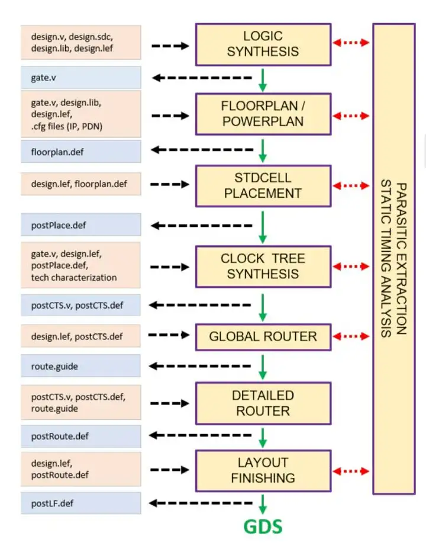

# OpenROAD 项目集成指南

## 一、引言与OpenROAD项目的部署

### 1. 引言

OpenROAD（Foundations and Realization of Open, Accessible Design）项目于2018年启动，旨在解决硬件设计中的高成本、专业知识门槛以及不可预测性问题。由Qualcomm、Arm、多所大学和合作伙伴共同开发，项目由加州大学圣地亚哥分校（UC San Diego）牵头，专注于数字系统芯片（SoC）设计中的RTL到GDSII阶段的全自动开源工具链开发。

该项目的主要目标是提供一个全自动的、无需人工干预的设计流程，支持从RTL（Register Transfer Level）到GDSII的快速设计。OpenROAD的核心特色在于消除设计中的成本、进度风险和不确定性，通过机器学习和智能算法，自动调优设计流程中的各个步骤。

OpenROAD流（flow）包括逻辑综合、底层布局、布局、时钟树综合、布线、寄生提取和时序分析等阶段。它能够使用Tcl脚本命令和Python绑定的API，灵活地控制设计流程，并已成功应用于多个学术和商业场景。

### 2. 主要工具

OpenROAD工具链由一组开源工具组成，这些工具将 RTL Verilog、constraints (.sdc)、liberty (.lib) 和 technology (.lef) 文件作为输入，目的是生成可用于流片的 GDSII 文件。图1说明了与单个OpenROAD任务对应的工具流。这些包括逻辑综合 (logic synthesis, LS)，floorplan (FP) 和 power delivery network (PDN) ，布局，时钟树综合 (CTS)，布线和版图生成。



#### A. Logic Synthesis

开源LS的主要短板在于时序意识 (timing awareness) 和优化。Alpha版本对开源工具 YOSYS/ABC 进行了三个方面的改进。首先，我们使用强化学习技术 (reinforcement learning) 来实现时序驱动逻辑优化的自主空间探索设计。为了产生针对不同电路的最佳的综合脚本，我们开发了一个强化学习代理来自动一步一步地生成综合脚本，以满足目标时间约束，同时使总面积最小。其次，我们改进了ABC中的基本缓冲算法，并通过将 RePlAce 布局工具集成到逻辑综合流程中来实现物理感知 (physical-aware) 的缓冲和门尺寸，从而在门尺寸和缓冲中使用基于全局布局的线电容来评估改进的时序结果。第三，我们在流中增加了 SDC 常用命令子集。

#### B. Floorplan and PDN

Floorplan 和 PDN 由 TritonFPlan 完成，它有两个主要组成部分。第一个部分是宏封装，由 RePlAce 的混合尺寸(宏和标准单元格)全局布局和输入IO布局预置。宏封装使用基于 Parquet 的模拟退火算法 (simulated annealing, SA). SA 使用B*树表示宏布局，并具有双重目标标准，即最大化标准单元放置区域，同时最小化线长。SA解决方案把顶级PDN固定在合适位置，同时考虑诸如宏的特定光晕约束和垂直/水平通道宽度。从原始的混合尺寸全局布局创建多个平面图解决方案。 TritonFPlan的第二个组件遵循一种按安全构造 (safe-by-construction) 的方法，为每个宏封装方案创建了一个DRC正确的PDN。金属和通孔几何规则是从用户指定的配置文件中提取的。 RePlAce用于根据估计的总导线长度（包括放置的标准单元）来确定这些平面图（with PDN）解决方案中的最佳方案。目前仅支持矩形平面图。端帽 (endcap)，tapcell 和 IO-pin 方法的实现正在进行中。

#### C. Placement and PDN refinement

RePlAce 是一款基于静电模拟的开源分析布局器，采用BSD协议。在OpenROAD中，RePlAce用于在 floorplanning 期间混合大小(宏和单元)布局，用于在给定 floorplan 中的标准单元布局，以及在时钟树综合(CTS)期间用于时钟缓冲区合法化。时序驱动的 RePlAce 工具采用工业标准 LEF/DEF、Verilog、SDC 和 Liberty 格式进行输入。RePlAce 包含了 (1) 用于估算 Steiner 线长的 FLUTE；(2) 一种用于寄生参数估计的快速 RC 估计器；(3) 用于在布局期间静态时间分析的 OpenSTA. RePlAce 应用基于 OpenSTA 分析的信号网重加权 (reweighting) 迭代来改善时序。注意，RePlAce 当前不会改变逻辑综合 (LS) 提供的 netlist。

布局后，PDN 根据空间电流分布的评估做进一步改进。主要目标是 PDN 的单通道、正确和安全构造。floorplan 阶段 PDN在整个芯片中使用单个间距 (single patch)，布局后，此 PDN 选择性地减值。芯片区域被平铺成区域，并且对于每个区域，选择一组已减填充的 PDN 布线模板。这些模板是可拼接的，因此它们在对接时遵守设计规则。PDN 工具将一组预定义的模板、用于早期设计的（floorplan 阶段）DEF 和可用的电源分析信息（例如，我们的 OpenSTA 工具可以提供基于实例的功率报告）作为输入。然后，训练过的卷积神经网络 （CNN） 为每个区域选择一个安全的模板。

#### D. Clock Tree Synthesis

TritonCTS基于GH-Tree(广义H-Tree)范式，对低功率、低偏移和低延迟时钟分布进行时钟树综合(CTS)。采用动态规划算法找到一个最小估计功率的时钟树拓扑结构，并且与给定的延迟和偏移目标一致。动态编程算法找到了具有最小估计功率的时钟树拓扑，且在给定的延迟时间和偏离目标之内。k-means算法适用于下沉聚类 (sink clustering)。TritonCTS 有与布局器器（RePlAce）的接口，用于插入时钟缓冲区合法化。

#### E. Global Routing

UTD-BoxRouter是BoxRouter 2.0 的修改版。该工具读取 LEF 和布局后的 DEF。它定义了称为 gcells 的全局布线单元，并执行全局布线以最小化单元内的拥塞和溢出，同时最小化线长和过孔 (vias)。 工具生成后续详细布线器执行所需的布线指导。 该全局布线器首先通过使用预布线，整数线性规划和基于协商的A*搜索 (negotiation-based A\* search) 来确保布线稳定性，从而解决2D布线的问题。 该全局布线器使用已知的过孔和阻塞的整数线性编程算法，使用层分配 (layer assignment) 执行2D到3D映射。

#### F. Detailed Routing

TritonRoute 以 LEF 和 布局后的 DEF 作为输入，然后在给定全局布线解决方案的情况下，对信号网络和时钟网络进行详细的布线，以布线指南的格式进行。 在进行详细的布线之前，(1) TritonRoute使用广度优先搜索对全局布线解决方案进行预处理，以减少在保证网络连接性的情况下在稍后阶段产生环路的可能性；(2) TritonRoute通过考虑方向和走线轨迹偏移量来识别唯一实例，并以引脚访问模式来帮助连接到引脚。

该流程依次进行以下操作：轨迹分配和详细的布线阶段。首先，轨迹分配使用快速贪婪启发式方法 (fast greedy heuristic) 确定每个全局布线段的轨迹。 其次，基于片段的初始详细布线解决了多终端，多网络交换盒布线问题。 片段可以并行布线。 在每个片段中，使用多端子A\*算法顺序布线网络。 第三，多次重复搜索和修改以减少线长和通孔数量，并提高 DRC 收敛性。

### 3. 分析工具

OpenROAD 在整个流程中使用了大量的分析工具和框架

#### A. Static Timing Analysis

OpenSTA 是商业 Parallax timer 的开源版本，采用 GPL3 协议。Paralla timer 引擎已商业性地提供近20年，并已被纳入许多的 EDA 和 IC公司的时序分析工具中。OpenSTA 在 GitHub 上开源。OpenSTA已经确认支持多个高级的 foundry nodes，并支持标准的时序报告样式

#### B. Parasitic Extraction

寄生参数提取(PEX)工具运行一个 foundry 的设计工具包(PDK)，以建立线电阻、地电容和对同一层或上下相邻层线的耦合电容的线性回归模型。一个基本的用例是流程中的另一个工具(例如，CTS，全局布线，定时分析)调用PEX，提供一个由特定线路和它的邻近组成的输入DEF文件。提供的输出文件包括提取的寄生参数。预期的改进包括连接PEX功能到未来可能的广泛的 IDEA 物理设计数据库，并扩展模型拟合方法，以实现低开销的寄生参数估计器，用于时序驱动布局，在全局布线期间的串扰估计。

#### C. Cloud Infrastructure

为了让用户利用OpenROAD工具以及其他协作者开发的工具，云基础设施项目旨在提供端到端无缝的用户体验。在我们的云部署中，用户将他们的Git repo 预定到我们的云系统。设计更改推送到Git repo后，OpenROAD流程会自动编译，当流程完成时，用户会收到一封电子邮件通知。然后用户可以通过浏览器下载结果文件。如果需要，用户还可以在基于web的前端监控流程的进程。我们的云部署是弹性的，当更多的用户登录到服务时，或者当用户请求并行处理能力时，它会利用更多的计算资源。

#### D. Integration and Testing

上述的工具构成一个工具链，该工具链产生可用于产生准备最终验证和制造的设计。最初的支持平台是CentOS 6。。在这里，我们利用了一个基于现有设计的测试用例套件，这些设计之前已经准备好了，这些设计的复杂性和工艺都有。我们的测试用例套件还包括不断开发的顶尖复杂的SoCs。持续的集成测试套件在开发期间会分别验证这些工具，并记录回归指标和特性影响。

### 4. 报告目标

#### 引言与OpenROAD项目的安装与编译

本报告的第一部分将详细说明如何获取OpenROAD项目源代码、安装必要依赖，以及如何使用CMake工具进行构建与编译。

#### 数字后端的交换文件格式

报告的第二部分将深入探讨数字后端设计中使用的交换文件格式，重点介绍LEF（Library Exchange Format）和DEF（Design Exchange Format）的结构及其在OpenROAD中的作用。

#### 开源数据库OpenDB的常用接口与内部数据结构

第三部分将介绍OpenROAD项目中的核心数据库模块——OpenDB。重点介绍OpenDB提供的常用接口，例如读取和写入LEF/DEF文件的API、如何使用这些API在数据库中构建和操作设计对象（如网络、模块、单元等）。此外，还会介绍OpenDB的内部数据结构，包括dbBlock、dbNet、dbInst等，以及如何使用这些数据结构来表示和管理芯片设计的各个方面。

#### 如何在OpenROAD中集成自定义代码

报告的第四部分将讨论如何在OpenROAD框架中集成自己的EDA工具或算法。具体内容将涵盖如何在OpenROAD项目中引入自定义功能模块，如何扩展OpenDB数据结构，如何通过Tcl或Python API加载自定义功能等。

#### 自定义代码的调用与测试

报告的最后一部分将介绍如何调用和测试集成的自定义代码。内容将包括如何通过OpenROAD的命令行或图形界面运行自定义流程，如何编写和执行回归测试确保代码正确性，以及如何在设计中使用自定义功能并验证其效果。

## 二、环境准备与安装

### 1. 安装依赖

``` shell
git clone --recursive https://github.com/The-OpenROAD-Project/OpenROAD-flow-scripts
cd OpenROAD-flow-scripts
sudo ./setup.sh
```

### 2. 本地构建OpenROAD

``` shell
./build_openroad.sh --local
```
### 3. 验证安装

在设置环境后，二进制文件应该可以通过 `$PATH` 访问。`make` 命令将从 RTL 到 GDSII 生成默认设计 `gcd`，使用 `nangate45` PDK。

``` shell
source ./env.sh
yosys -help
openroad -help
cd flow
make
```

你可以使用以下命令在 OpenROAD GUI 中查看最终布局图像。

``` shell
make gui_final
```

## 三、数字后端的交换文件格式

在集成电路的物理设计过程中，LEF、DEF 和 LIB 文件各自扮演了重要的角色。它们用于描述芯片的不同方面，包括物理布局、设计连接和电气特性。以下是每个文件格式的介绍及其基本示例。

### 1. LEF (Library Exchange Format) 文件

LEF 文件用于描述标准单元库（cell library）的物理布局抽象信息，定义了电路设计中用于布局和布线的物理参数。

**LEF 文件的关键内容：**
- **图层定义**：设计中不同的金属层和通孔层的属性，如宽度、间距和设计规则。
- **标准单元信息**：单元的物理尺寸（宽度和高度），针脚的位置、方向（输入/输出）和电气属性。
- **阻碍区域**：不能用于布线的区域。
- **制造网格**：定义设计的分辨率和网格大小。
- **天线规则**：防止制造过程中出现天线效应的规则。

**示例：**
```spice
MACRO AND2X1
    CLASS CORE ; 
    ORIGIN (0.0, 0.0) ; 
    SIZE 2.0 BY 1.0 ; 

    PIN A
        DIRECTION INPUT ; 
        USE SIGNAL ; 
        PORT
            LAYER Metal1 ;
                RECT (0.0 0.0) (0.2 0.2) ;
        END
    END A
    
    PIN Y
        DIRECTION OUTPUT ; 
        USE SIGNAL ; 
        PORT
            LAYER Metal1 ;
                RECT (1.8 0.8) (2.0 1.0) ;
        END
    END Y
END AND2X1
```
这个例子定义了一个 AND2X1 标准单元的物理布局，宽度为 2.0，高度为 1.0，针脚 A 是输入，针脚 Y 是输出。

### 2. DEF (Design Exchange Format) 文件

DEF 文件用于描述整个芯片设计的物理布局和连接信息，定义芯片中各组件的位置、布线以及电源和地网络等特殊网络的布局。

**DEF 文件的关键内容：**
- **组件放置**：描述芯片设计中标准单元和宏单元的位置。
- **布线信息**：详细描述电路中各组件之间的布线。
- **网表（netlist）**：组件之间的连接关系。
- **特殊网络**：如电源和地网络的布线。
- **设计约束**：描述设计的布局和布线约束。

**示例：**
```spice
COMPONENTS 2 ;
    - U1 AND2X1 + PLACED (10, 20) N ;
    - U2 INVX1 + PLACED (50, 50) N ;
END COMPONENTS

NETS 1 ;
    - net1 ( U1 Y ) ( U2 A ) ;
END NETS

SPECIALNETS 1 ;
    - VDD + ( U1 VDD ) ( U2 VDD ) ;
END SPECIALNETS
```
这个 DEF 文件描述了一个包含两个组件（U1 和 U2）的设计，它们分别放置在指定的芯片位置，net1 表示它们之间的连接，VDD 表示电源网络。

### 3. LIB (Library) 文件

LIB 文件包含有关标准单元的电气属性、时序和功耗信息，用于时序分析和功耗估算。该文件定义了每个单元的输入输出时序、逻辑功能、功耗、以及工艺条件等。

**LIB 文件的关键内容：**
- **时序信息**：定义了输入输出路径的延迟、建立时间（setup time）和保持时间（hold time）。
- **功耗信息**：定义了单元在不同状态下的功耗，包括漏电功耗（leakage power）和动态功耗。
- **逻辑功能**：定义了每个标准单元执行的逻辑操作。
- **工艺条件**：包括工作电压、温度和工艺角（process corner）。
- **功耗弧（power arc）**：描述不同输入状态下的功耗。

**示例：**
```spice
cell (AND2X1) {
    area : 2.0 ;
    pin(A) {
        direction : input ;
        capacitance : 0.01 ;
    }
    pin(B) {
        direction : input ;
        capacitance : 0.01 ;
    }
    pin(Y) {
        direction : output ;
        function : "A & B" ;
        timing() {
            related_pin : "A" ;
            rise_transition : 0.1 ;
            fall_transition : 0.1 ;
            cell_rise : 0.2 ;
            cell_fall : 0.2 ;
        }
    }
}
```
这个例子定义了一个 AND2X1 单元的电气属性，包括输入输出针脚的方向、时序信息和逻辑功能。

## 四、OpenDB 的常用接口与内部数据结构

OpenDB 是 OpenROAD 项目中的核心数据库模块，用于管理数字集成电路设计中的物理和逻辑信息。OpenDB 的核心功能是通过一系列 API 提供对设计数据的读写、操作和查询，并以高效的方式表示芯片设计的各个部分。下面介绍 OpenDB 的常用接口和内部数据结构。

### 1. 常用接口

OpenDB 是 OpenROAD 中的一个重要模块，它通过提供高效的数据库结构来管理物理设计的组件、网络连接以及布局信息。以下是一些常用接口及其在物理设计中的信息访问方法。

#### 1.1 访问设计的基础信息

在 `ChipletModuleWrapper::printDesignInfo` 函数中，可以通过 OpenDB 的 API 访问设计中的一些关键信息：

- **Block 名称**：使用 `_block->getName()` 获取设计中顶层块的名称。
- **Block 面积**：通过 `dbBox* bbox = _block->getBBox()` 获取芯片块的边界框（bounding box），并计算芯片的物理面积。

示例代码：

```cpp
odb::dbBox* bbox = _block->getBBox();
if (bbox) {
    int llx = bbox->xMin();
    int lly = bbox->yMin();
    int urx = bbox->xMax();
    int ury = bbox->yMax();
    int width = urx - llx;
    int height = ury - lly;
    ofs << "Block area: " << width << " x " << height << "\n";
}
```

#### 1.2 访问设计中的实例

设计中的每个实例（如标准单元或宏单元）都是通过 `dbInst` 对象表示的。可以通过 `_block->getInsts()` 获取设计中的所有实例，并访问每个实例的名称、主元（master）名称以及位置信息。

- **实例名称**：使用 `inst->getName()` 获取实例的名称。
- **主元名称**：使用 `inst->getMaster()->getName()` 获取实例的主元信息（如标准单元库中定义的单元类型）。
- **实例位置**：使用 `inst->getLocation()` 返回实例的坐标（x, y）。

示例代码：

```cpp
for (auto inst : _block->getInsts()) {
    ofs << "Instance name: " << inst->getName() << "\n";
    ofs << "Master name: " << inst->getMaster()->getName() << "\n";
    ofs << "Instance location: " << inst->getLocation().getX() << " x " << inst->getLocation().getY() << "\n";
}
```

#### 1.3 访问网络信息

在设计中，网络（net）连接了各个实例和引脚，用于表示信号传输的路径。可以通过 `_block->getNets()` 获取所有网络，并通过 `dbNet` 对象获取每个网络的名称及其连接的引脚（ITerm 和 BTerm）。

- **网络名称**：使用 `net->getName()` 获取网络名称。
- **ITerm（实例引脚）信息**：使用 `net->getITerms()` 获取网络连接的实例引脚，并通过 `iterm->getInst()->getName()` 获取引脚所属的实例名称。
- **BTerm（块引脚）信息**：使用 `net->getBTerms()` 获取网络连接的块引脚，并通过 `bterm->getName()` 和 `bterm->getBlock()->getName()` 获取引脚和所属块的名称。

示例代码：

```cpp
for (auto net : _block->getNets()) {
    ofs << "Net name: " << net->getName() << "\n";
    ofs << "Net connections: " << net->getITerms().size() << " drivers, " << net->getBTerms().size() << " loads\n";

    ofs << "ITerms:\n";
    for (auto iterm : net->getITerms()) {
        ofs << "  Instance: " << iterm->getInst()->getName() << ", Pin: " << iterm->getMTerm()->getName() << "\n";
    }

    ofs << "BTerms:\n";
    for (auto bterm : net->getBTerms()) {
        ofs << "  BTerm: " << bterm->getName() << " Block: " << bterm->getBlock()->getName() << "\n";
    }
}
```

#### 1.4 模块实例信息

模块实例（mod_inst）通常表示更大的逻辑模块，它们也是通过 `dbModInst` 对象来管理的。可以通过 `_block->getModInsts()` 获取模块实例，并打印其主元信息。

- **模块实例名称**：使用 `mod_inst->getMaster()->getName()` 获取模块实例的名称。

示例代码：

```cpp
for (auto mod_inst : _block->getModInsts()) {
    ofs << "mod inst: " << mod_inst->getMaster()->getName() << "\n";
}
```

### 2. 内部数据结构

OpenDB 通过一系列数据结构来表示和管理芯片设计的各个方面。以下是一些关键的数据结构：

- **dbBlock**：表示设计的顶层块，包含所有的实例、网络、模块实例等。
- **dbInst**：表示设计中的实例，如标准单元或宏单元。
- **dbNet**：表示设计中的网络，连接各个实例和引脚。
- **dbModInst**：表示模块实例，通常是更大的逻辑模块。
- **dbBox**：表示边界框，用于定义物理区域。

这些数据结构通过丰富的接口提供对设计数据的访问和操作，用户可以根据需要扩展和定制这些数据结构，以满足特定的设计需求。

### 3. 结果输出示例

以下是通过上述接口获取的设计信息示例：

```
Design information:
Block name: top
Block area: 1388280 x 1388800
Number of instances: 84546
...
Instance name: rof1_0__core/fe/icache_1/data_mem_banks_7__data_mem_bank/macro_mem/_1_
Master name: LOGIC1_X1
Instance location: 0 x 0
Instance name: rof1_0__core/fe/icache_1/data_mem_banks_7__data_mem_bank/macro_mem/mem
Master name: fakeram45_512x64
Instance location: 0 x 0
IsBlock
Instance name: rof1_0__core/fe/icache_1/metadata_mem.macro_mem.mem
Master name: fakeram45_64x7
Instance location: 0 x 0
IsBlock
Instance name: rof1_0__core/fe/icache_1/tag_mem.macro_mem.mem
Master name: fakeram45_64x96
Instance location: 0 x 0
IsBlock
...
Net name: _0_
Net connections: 1 drivers, 0 loads
ITerms:
  Instance: _2_, Pin: Z
BTerms:
Net name: _1_
Net connections: 4 drivers, 0 loads
ITerms:
  Instance: _3_, Pin: Z
  Instance: rof1_0__core/fe/icache_1/_28269_, Pin: A
  Instance: rof1_0__core/fe/icache_1/_28788_, Pin: A
  Instance: rof1_0__core/fe/icache_1/_28855_, Pin: A
BTerms:
Net name: cce_inst_boot_rom_addr_o[0]
Net connections: 3 drivers, 1 loads
ITerms:
  Instance: me/genblk1_0__bp_cce_top/bp_cce/pc_inst_ram/_0681_, Pin: A2
  Instance: me/genblk1_0__bp_cce_top/bp_cce/pc_inst_ram/_1041_, Pin: A
  Instance: me/genblk1_0__bp_cce_top/bp_cce/pc_inst_ram/_1045_, Pin: Q
BTerms:
  BTerm: cce_inst_boot_rom_addr_o[0] Block:  topmod inst: top.me
... 
mod inst: top.me.genblk1_0__bp_cce_top
mod inst: top.me.genblk1_0__bp_cce_top.bp_cce
mod inst: top.me.genblk1_0__bp_cce_top.bp_cce.pc_inst_ram
mod inst: top.me.genblk1_0__bp_cce_top.bp_cce.pc_inst_ram.cce_inst_ram
mod inst: top.me.genblk1_0__bp_cce_top.bp_cce.pc_inst_ram.cce_inst_ram.macro_mem
```

## 如何在 OpenROAD 中集成自定义代码

在 OpenROAD 中集成自定义代码，允许用户根据项目需求扩展或修改现有的设计流程。这一部分将展示如何在 OpenROAD 框架中引入自定义的 EDA 工具或算法，包括如何扩展 OpenDB 的数据结构、编写新的功能模块、以及如何通过 Tcl 加载和调用这些自定义功能。

例如，我们现在展示在 OpenROAD 的 mpl2 中集成一段自己的代码的流程。在不动已有流程的代码的基础上，实现构建超图、完成超图到图结构的映射、实现使用聚类算法对电路图进行聚类的操作。

### 1. 为 OpenDB 项目代码增加 tcl 指令与指令调用的 c++ 接口

要在OpenROAD中增加自定义命令，首先需要在项目中定义一个Tcl命令，并通过C++接口实现它的功能。例如，你定义了一个新的Tcl命令`cluster_std_cell_leiden_algorithm_cmd`，该命令调用 Leiden 聚类算法并在终端中打印输入参数：

### 2. 从 OpenROAD 中获取不同的工具接口

在 OpenROAD 项目中，OpenRoad 类作为整个系统的核心管理者，提供了接口来获取各种工具和设计数据结构。集成自定义代码时，需要通过 OpenRoad 类来访问这些工具和数据库。在 OpenROAD 中，主要的工具模块涵盖了布局、时序分析、布线、聚类等不同阶段的 EDA 工具。

#### 访问 OpenROAD 的工具和数据库

通过以下代码可以获取 OpenROAD 实例，并从中获取设计数据库（OpenDB）：

```cpp
/**
 * get the openroad tool top
 * use interface to get tools
 */
ord::OpenRoad* openroad = ord::OpenRoad::openRoad();
auto db = openroad->getDb();
```

- `OpenRoad::openRoad()`：这是一个全局访问器，用于获取 OpenROAD 的单例对象。
- `getDb()`：获取 OpenDB 实例，允许你访问设计的物理布局、实例和网络连接等信息。

#### 主要工具的访问方法

OpenROAD 中集成了多个 EDA 工具，你可以通过 OpenRoad 类的接口访问这些工具。以下是部分常用工具的获取方法：

**时序分析工具 (STA)**：

获取 STA 工具对象，用于执行时序分析：

```cpp
auto sta_tool = openroad->getSta();
```

**宏单元布局工具 (Macro Placer)**：

获取用于布局宏单元的工具 MacroPlacer2：

```cpp
auto macro_placer = openroad->getMacroPlacer2();
```

**布线工具 (TritonRoute)**：

获取详细布线工具 TritonRoute：

```cpp
auto router = openroad->getTritonRoute();
```

**全局路由工具 (GlobalRouter)**：

获取全局路由工具：

```cpp
auto global_router = openroad->getGlobalRouter();
```

**IO 引脚布局工具 (IOPlacer)**：

获取 IO 引脚布局工具：

```cpp
auto io_placer = openroad->getIOPlacer();
```

#### 从工具中获取数据并执行算法

当你通过 OpenRoad 实例获取所需的工具后，可以进一步操作这些工具获取设计数据，或运行相应的 EDA 算法。例如，你可以获取设计中的块（block）、实例（instance）、网络（net）等，并将其传递给自定义算法处理。

例如，获取当前设计的块数据：

```cpp
odb::dbBlock* block = db->getChip()->getBlock();
```

### 3. 数据结构的对接

在 OpenROAD 中，数据结构对接是将 OpenDB 中提取的设计信息转换为你的自定义算法所需的数据结构的一步。聚类算法（如 Leiden 算法）通常会依赖于电路的拓扑信息，包括实例（instances）、网络（nets）和连接方式。通过访问 OpenDB 提供的接口，你可以从设计数据库中提取这些信息，并转换为算法所需的图（graph）或超图（hypergraph）结构。

#### 提取实例和网络信息

在 OpenROAD 中，通过以下代码可以获取设计的实例和网络信息：

```cpp
odb::dbBlock* block = db->getChip()->getBlock();

// 获取设计中的所有实例
for (auto* inst : block->getInsts()) {
    std::string inst_name = inst->getName();
    auto* master = inst->getMaster();
    odb::Point loc = inst->getLocation();
    
    // 可以将实例的信息传递给聚类算法
    clustering_algorithm.addInstance(inst_name, master, loc);
}

// 获取设计中的所有网络
for (auto* net : block->getNets()) {
    std::string net_name = net->getName();

    // 获取网络连接的所有实例引脚
    for (auto* iterm : net->getITerms()) {
        auto* inst = iterm->getInst();
        clustering_algorithm.addConnection(inst->getName(), iterm);
    }
}
```

以上代码提取了每个实例的名称、位置和主元（master）信息，并提取了每个网络中的连接关系。这些信息可以构建成一个图或超图结构，然后传递给你的自定义聚类算法进行处理。

#### 将信息传递给自定义算法

在构造好电路的拓扑结构后，你可以将这些数据传递给自定义算法。在你的例子中，`leidenClustering` 类负责执行聚类操作：

```cpp
auto leiden_clustering = std::make_unique<leidenClustering>(db, block, openroad->getLogger());
leiden_clustering->run();
```

这里的 `run()` 函数将处理从 OpenDB 提取的设计信息，并根据聚类算法的结果生成新的分区或分组信息。

### 4. 更新数据库信息

在完成聚类算法后，通常需要将算法的结果写回到 OpenDB 中，这样设计的变化就可以反映在数据库中，并用于后续的布局、布线等操作。

#### 更新实例信息

假设你的聚类算法会为每个实例生成一个分组 ID，你可以将这个分组信息存储回每个实例对象中。OpenDB 提供了丰富的接口来修改设计中的实例和网络信息。下面是一个示例，展示如何更新实例的属性：

```cpp
for (const auto& result : leiden_clustering->ClusteringResults()) {
    std::string inst_name = result.instance_name;
    int group_id = result.group_id;

    // 查找实例并更新分组信息
    odb::dbInst* inst = block->findInst(inst_name.c_str());
    if (inst) {
        setGroup(inst, group_id);  // 假设你使用 setUserData 存储分组ID
        logger_->report("Updated instance {} with group ID {}", inst_name, group_id);
    }
}
```

在这个例子中，`setGroup` 函数用于为每个实例存储一个自定义的分组 ID（可以是聚类结果）。通过这种方式，算法的输出可以直接写入设计数据库，并用于后续的设计步骤。

#### 更新网络信息

如果聚类算法对电路的网络连接也有影响（例如修改了连接关系或优化了某些网络），你也可以使用 OpenDB 的接口来更新网络信息。以下是一个示例，展示如何更新网络的连接信息：

```cpp
for (const auto& net_result : leiden_clustering->getNetResults()) {
    std::string net_name = net_result.net_name;

    // 查找网络并更新连接信息
    odb::dbNet* net = block->findNet(net_name.c_str());
    if (net) {
        // 假设删除现有的连接并添加新的连接
        net->disconnectAll();

        for (const auto& connection : net_result.connections) {
            odb::dbInst* inst = block->findInst(connection.inst_name.c_str());
            odb::dbITerm* iterm = inst->findITerm(connection.pin_name.c_str());
            net->connect(iterm);
        }
        logger_->report("Updated net {} with new connections", net_name);
    }
}
```

通过这个流程，网络的连接关系可以根据聚类算法的结果进行更新，确保设计的拓扑结构与算法输出保持一致。

#### 完整流程

1. **提取设计数据**：从 OpenDB 提取实例、网络等信息，构建电路的图或超图结构。
2. **执行算法**：将电路数据传递给自定义算法（如 Leiden 聚类算法），运行算法得到结果。
3. **更新数据库**：将算法的结果写回 OpenDB，更新实例的分组信息或网络的连接关系。
4. **保存设计**：最后，可以将更新后的设计保存为新的数据库文件或 DEF 文件，以便进行后续的布局或布线步骤。

## 调用与测试

在自定义功能模块集成后，进行调用与测试是确保新功能正常工作的关键步骤。OpenROAD 提供了回归测试框架和 GUI 工具，帮助用户调试和验证设计。

**测试步骤：**

1. **编写测试脚本**：为自定义功能编写 Tcl 测试脚本，确保模块能在不同设计条件下正常工作。

    ```tcl
    source custom_script.tcl
    custom_placer
    ```

2. **回归测试**：使用 OpenROAD 内置的回归测试工具，确保集成后的代码没有破坏现有功能。

    ```bash
    ./test/regression
    ```

3. **使用 GUI 调试**：通过 OpenROAD 提供的图形用户界面（GUI），可视化设计流程，观察自定义功能的效果。

    ```bash
    openroad -gui
    ```

## 总结

通过本报告的介绍，读者可以对 OpenROAD 项目的开发和集成有一个深入的理解。OpenROAD 是一个强大的开源 EDA 平台，通过一系列工具和数据库接口支持从 RTL 到 GDSII 的自动化设计流程。本文档详细描述了如何部署 OpenROAD 项目、如何处理数字后端交换文件格式、以及如何使用 OpenDB 接口访问和操作设计数据。

在自定义功能的集成部分，我们讨论了如何在 OpenROAD 框架中引入自定义算法和工具，包括如何通过 Tcl 和 C++ 接口加载自定义命令。通过具体的例子，说明了如何利用 OpenDB 提取设计信息，并将其传递给自定义算法，如聚类算法（Leiden Algorithm），最终将算法结果写回 OpenDB，更新设计信息以反映优化效果。

通过 OpenROAD 的灵活性和可扩展性，用户可以根据特定需求定制 EDA 工具和设计流程，集成并测试新的优化算法。通过 OpenROAD 提供的 GUI 和回归测试框架，设计人员可以高效验证自定义代码的正确性并确保其有效性。OpenROAD 项目为学术界和工业界提供了一个强大的平台，使芯片设计的各个步骤变得更加自动化和可控。

## 参考文献

[1] T. Ajayi et al., "INVITED: Toward an Open-Source Digital Flow: First Learnings from the OpenROAD Project," 2019 56th ACM/IEEE Design Automation Conference (DAC), Las Vegas, NV, USA, 2019, pp. 1-4.

[2] J. Chen et al., "DATC RDF-2019: Towards a Complete Academic Reference Design Flow," 2019 IEEE/ACM International Conference on Computer-Aided Design (ICCAD), Westminster, CO, USA, 2019, pp. 1-6, doi: 10.1109/ICCAD45719.2019.8942120.

[3] A. B. Kahng, "Looking Into the Mirror of Open Source: Invited Paper," 2019 IEEE/ACM International Conference on Computer-Aided Design (ICCAD), Westminster, CO, USA, 2019, pp. 1-8, doi: 10.1109/ICCAD45719.2019.8942131.

[4] A. Rovinski, T. Ajayi, M. Kim, G. Wang and M. Saligane, "Bridging Academic Open-Source EDA to Real-World Usability," 2020 IEEE/ACM International Conference On Computer Aided Design (ICCAD), San Diego, CA, USA, 2020, pp. 1-7.

[5] A. B. Kahng, "Open-Source EDA: If We Build It, Who Will Come?," 2020 IFIP/IEEE 28th International Conference on Very Large Scale Integration (VLSI-SOC), Salt Lake City, UT, USA, 2020, pp. 1-6, doi: 10.1109/VLSI-SOC46417.2020.9344073.

[6] https://openroad.readthedocs.io/en/latest/main/README.html

[7] https://openroad-flow-scripts.readthedocs.io/en/latest/user/UserGuide.html

[8] [GitHub - The-](https://github.com/The-OpenROAD-Project/OpenROAD-flow-scripts)[OpenROAD](https://github.com/The-OpenROAD-Project/OpenROAD-flow-scripts)[-Project/](https://github.com/The-OpenROAD-Project/OpenROAD-flow-scripts)[OpenROAD](https://github.com/The-OpenROAD-Project/OpenROAD-flow-scripts)[-flow-scripts: ](https://github.com/The-OpenROAD-Project/OpenROAD-flow-scripts)[OpenROAD's](https://github.com/The-OpenROAD-Project/OpenROAD-flow-scripts)[ scripts implementing an RTL-to-GDS Flow. Documentation at ](https://github.com/The-OpenROAD-Project/OpenROAD-flow-scripts)https://openroad-flow-scripts.readthedocs.io/en/latest/