# OpenSTA代码阅读

 

# 1、动机

​    期中对OpenROAD开源工具流程进行了介绍和演示，在OpenROAD流程中，多次调用了OpenSTA这一开源静态时序分析工具，恰好我的研究领域是EDA方面的时序分析，我便阅读了这一部分的代码，并对其中ssta部分进行了小小的修改，来验证对于non-Gaussian分布的函数拟合。OpenSTA是使用C++进行开发的，并且使用了Tcl脚本命令来进行控制，阅读OpenSTA代码对于提升代码水平，增进C++相关知识有很大的帮助。

# 2、OpenSTA代码结构：

​    OpenSTA的代码按照STA中的不同功能进行分开实现，STA 的主要组件（例如网络、时序图、sdc 和搜索）作为单独的类实现。Sta类包含每个组件的一个实例。Sta 类定义了 Tcl 接口使用的大部分外部可见 API，并协调涉及多个组件的操作。 例如，当在 Tcl 命令解释器中输入错误路径命令时，Sta 将声明传递给 Sdc 组件，并告诉搜索组件使所有到达和所需时间无效。接下来按照不同功能来详细讲一下OpenSTA的代码结构和组成。

## 2.1 /app

​    OpenSTA工具的主函数代码在/app文件夹下，其中包含三个文件，分别是Main.cc，StaMain.cc，StaApp.i。

#### 2.1.1 Main.cc

Main.cc是OpenSTA的主程序文件，主要负责解析命令行参数，初始化环境，其中调用了initStaApp函数，来创建和配置STA对象，并根据用户输入执行相应操作。其中比较重要的是解析命令行参数和根据用户输入执行操作，首先会使用 stringEq 函数检查是否有-help或-version参数，如果有，则直接输出对应信息，如果输入的是Tcl脚本，则调用‘Tcl_Init’函数初始化Tcl环境，接着使用 sourceTclFile 和 evalTclInit 函数执行特定的Tcl脚本文件或Tcl命令。

总体而言，这是OpenSTA的启动入口，负责程序的启动流程，并根据输入执行相应操作。

#### 2.1.2 StaMain.cc

StaMain.cc文件主要用于解析命令行参数、处理Tcl脚本和初始化程序。该文件中包含了可以解析并处理命令行的函数，以供Main.cc调配使用。该代码处理了程序的启动和初始化，确保命令行参数和Tcl脚本正确解析和执行。

#### 2.1.3 StaApp.i

  StaApp.i是一个SWIG接口文件，用于生成OpenSTA的Tcl接口。SWIG 是一种软件开发工具，它将C/C++程序连接到其他编程语言。在这里，%module sta声明了一个名为sta的模块，而%include指令则包含了其他接口文件，如Exception.i、StaTcl.i、Verilog.i 等。这些接口文件定义了 OpenSTA 在 Tcl 环境中的功能和命令，允许用户通过 Tcl 脚本来操作和访问 OpenSTA 的核心功能。

#### 2.1.4 SWIG封装Tcl脚本命令

​    Tcl（Tool Command Language）脚本是一种动态编程语言，常用于嵌入式系统、测试、原型设计和自动化任务。Tcl脚本的设计目标是易于学习、使用和扩展。它提供了一种简洁的语法来快速创建和执行脚本，使得它在快速开发和自动化方面非常受欢迎。Tcl广泛应用于电子设计自动化（EDA）和网络环境，尤其在配置、测试和界面自动化中表现出色。Tcl的特点包括它的灵活性、扩展性和高级数据处理能力。

SWIG（Simplified Wrapper and Interface Generator）是一个软件开发工具，它用于将C或C++代码自动封装成其他编程语言的库，例如Python、Perl、Ruby、Java，以及Tcl等。使用SWIG，开发者可以编写扩展或模块，允许这些语言调用C或C++代码。对于Tcl，SWIG的工作流程大致如下：1. 编写C++函数：首先在C++中定义所需的函数。2.创建SWIG接口文件：在一个`.i`文件中声明这些C++函数。这个文件告诉SWIG哪些函数需要被封装。3. 运行SWIG：使用SWIG工具处理`.i`文件，指定Tcl作为目标语言。SWIG会生成包含封装代码的C++源文件。4.编译生成的代码：编译这些生成的C++文件，创建一个动态链接库（DLL或.so文件）。5.在Tcl脚本中使用：在Tcl脚本中，使用`load`命令加载生成的库。之后，就可以像使用普通Tcl命令一样使用这些C++函数了。通过这种方法，开发者可以使得Tcl脚本能够访问和利用C++编写的高性能函数和类。这样的集成有助于提高应用程序的性能，同时保持编程的灵活性和便利性。

​    我们以下面这个例子来说明：对于一个C++函数：

/* File : example.cc */

 

double My_variable = 3.0;

 

/* Compute factorial of n */

int fact(int n) {

if (n <= 1)

return 1;

else

return n*fact(n-1);

}

 

/* Compute n mod m */

 

int my_mod(int n, int m) {

return(n % m);

}

假设我们想要从Tcl访问这些函数和全局变量My_variable。首先需要制作一个以.i结尾的 SWIG 接口文件，如下所示：

/* File : example.i */

%module example

%{

/* Put headers and other declarations here */

extern double My_variable;

extern int fact(int);

extern int my_mod(int n, int m);

%}

 

extern double My_variable;

extern int fact(int);

extern int my_mod(int n, int m);

 

接口文件包含C++函数原型和变量声明。%module 指令定义将由 SWIG 创建的模块的名称。 %{ %} 块提供了一个位置，用于将附加代码（例如C++头文件或附加C+声明）插入到生成的C++包装器代码中。

SWIG使用swig命令调用。我们可以使用它来构建 Tcl模块（在Linux下），如下所示：

unix > swig -tcl example.i

这将生成一个example_wrap.c

unix > gcc -c -fpic example.c example_wrap.c -I/usr/local/include

这会编译生成example_wrap.o

unix > gcc -shared example.o example_wrap.o -o example.so

这样就编译生成了Tcl可以调用的库

unix > tclsh

% load ./example.so

% fact 4

24

% my_mod 23 7

2

% expr $My_variable + 4.5

7.5

swig 命令生成一个名为 example_wrap.c 的新文件，该文件应与 example.c 文件一起编译。 现在大多数操作系统和脚本语言都支持动态加载模块。在示例中，我们的Tcl模块已编译为可以加载到 Tcl 中的共享库。 加载后，Tcl 现在可以访问 SWIG 接口中声明的函数和变量。

我们具体看OpenSTA中，刚才提到StaApp.i文件中定义了多个子文件接口，我们以DelayCalc为例，这一部分的函数主要定义了STA中延时计算的部分。在OpenSTA中，`DelayCal.tcl` 和 `Delay Calc.i` 文件协同工作，将C++函数封装为Tcl命令。其中Delay Calc.i是一个SWIG接口文件，用于定义C++函数和Tcl命令之间的映射。例如，`delay_calc_names` 函数在C++中定义，然后通过SWIG暴露给Tcl，允许在Tcl环境中直接调用。这个文件包括了一些C++函数的声明和实现，以及它们应该如何映射到Tcl命令。而DelayCal.tcl是一个Tcl脚本，其中使用了由`Delay Calc.i`通过SWIG生成并暴露的命令。这些命令在Tcl脚本中作为标准的Tcl过程调用，它们背后实际上是执行C++中定义的功能。结合起来，这两个文件允许OpenSTA的用户通过Tcl脚本利用C++编写的高性能功能，实现静态时序分析。而对于整个OpenSTA来说，所有的tcl命令最后都封装在了sta_swig.a库中，该库基于之前所说的StaApp.i文件。

​    使用SWIG相比于直接编译C++来说，首先简化了封装的过程，SWIG自动处理多语言接口的封装，无需手动编写大量的接口代码，其次提高了开发效率，通过自动生成绑定代码，SWIG显著减少了开发时间和工作量，此外它还增强了代码的可维护性，只需维护C++源代码，SWIG负责生成的绑定代码，这样降低了代码维护的复杂性。最后，SWIG还支持多种编程语言，能够为不同的语言生成绑定，提高代码的可用性。

 

## 2.2 Liberty

在STA中，我们肯定会关注延时是如何计算出来的。而延时的计算首先要读取库文件中各种器件的延时参数信息，这里主要是在liberty目录下的函数进行：

Liberty时序库阅读器构建了一些派生自具体库类的类。除了库、单元(cell)和端口类，还有代表时序弧、时序模型、线载模型、操作条件以及用于折算时序数据的比例因子的类。

什么是时序弧(timingarc)呢，时序弧被分组为单元端口间的一组弧。例如，缓冲器在输入和输出之间有两个时序弧；一个用于上升输出，另一个用于下降输出。这些时序弧是：

 A r -> Z r

 A f -> Z f

由于缓冲器是非反相的，因此时序弧组是正单调的。类似地，反相器有两个负单调的时序弧。

 A f -> Z r

 A r -> Z f

另一方面，多路复用器，由于输入上的上升或下降变化可能导致输出上升或下降，所以从选择输入到输出的路径是非单调的。这个弧组中有四个时序弧：

 S f -> Z r

 S f -> Z f

 S r -> Z r

 S r -> Z f

Liberty文件阅读器还可以定制，以读取STA不使用的属性。

OpenSTA中读取时序库的命令为read_liberty，封装在liberty.tcl文件中：

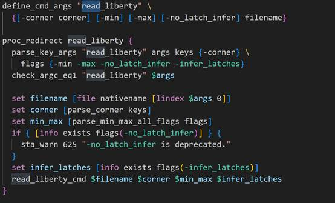

而对应的.i接口文件中定义了：

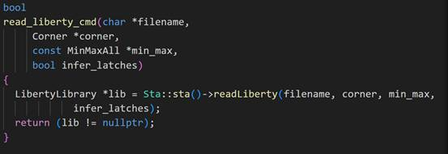

表明了对应的c++函数为Sta类中的readLiberty函数，其对应的c++函数定义在Search目录下的readLiberty函数中。

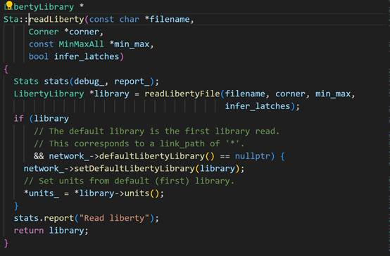

最终的调用仍是liberty目录下的LibertyReader.cc内的readLibertyFile函数，使用该函数读取时序库中的leaf cell的信息。

在数字集成电路设计中，"leaf cell"（叶子单元）通常指的是设计中最基本的、不可再分的逻辑单元或元件。这些单元是数字电路的基本构建块，通常用于实现诸如门、触发器、锁存器等基本逻辑功能。Leah cell 通常是由设计工具提供的标准单元库（Standard Cell Library）中的元件，这个库包含了一系列预先设计和验证过的标准逻辑单元。这些单元具有特定的功能、面积、功耗和时序特性，可以在设计中被实例化并连接在一起，以构建更复杂的数字电路。"Liberty files" 定义了这些叶子单元的时序、功耗、面积等性能信息。"read_liberty" 命令或 Sta::readLibertyFile 函数可用于读取这些文件，将这些信息导入到设计工具中，以便在后续的综合和布局布线过程中使用。

LibertyReader.cc内的readLibertyFile函数使用

parseLibertyFile(filename, this, report_);

来解析读入的lib文件，`LibertyParse_parse` 函数是 Liberty 文件的解析器入口点，用于启动 Liberty 文件的语法解析过程。该函数的主要任务是调用 Lex 和 Yacc 工具生成的解析器进行实际的解析工作。在具体流程中，它首先调用Lex生成的词法分析器（lexical analyzer）读取 Liberty 文件内容。然后调用 Yacc 生成的语法分析器（parser）根据 Lex 提供的词法单元进行语法解析。在解析的过程中，根据文法规则构建相应的语法树节点，表示Liberty 文件的结构。最后根据解析的结果，执行相应的操作。例如，在解析到 `define` 关键字时，会调用 `makeLibertyDefine` 函数创建相应的 Liberty 定义。这个解析器通过调用 Lex 和 Yacc 工具生成的代码来识别和理解 Liberty 文件的语法结构，帮助构建抽象语法树，从而使得程序能够理解和处理 Liberty 文件中描述的数字电路标准单元库的信息。

在读取library时，定义了一系列vistors，在解析Liberty文件时，通过定义这些vistors，可以在不同的Liberty组和属性出现时触发相应的处理逻辑。这是一种使用vistors设计模式来处理不同类型的节点的常见做法。

具体而言，该段代码定义了与Liberty文件中的不同部分相关的vistors，例如与"library"组相关的vistors、与"time_unit"属性相关的vistors等等。每个访问者都对应于LibertyReader类的成员函数，用于在相应的情况下执行特定的操作。例如，在解析到"library"组时，将会调用LibertyReader::beginLibrary和LibertyReader::endLibrary函数。

这种设计模式使得在处理Liberty文件时，可以灵活地扩展和修改处理逻辑，而不必修改主要的LibertyReader类。相反，只需添加或修改相应的vistors函数即可。这有助于将解析器的结构清晰化，提高代码的可维护性。

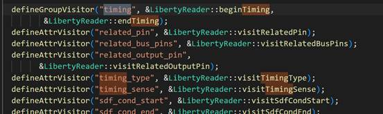

 

## 2.3 Graph

时序图(Timing Graph)是延迟计算和搜索算法使用的核心数据结构。它被标注了时序弧的延迟值和波动值（来自SDF或延迟计算器）。前向搜索会用到达时间标注图，而后向搜索会用所需时间标注。这个图由顶点和边组成。设计中的每个引脚都有一个顶点。双向引脚有两个顶点，一个用作输入，另一个用作输出。

图中的边连接顶点。通过网连接在一起的引脚，在引脚顶点之间有线边。叶实例时序模型中的时序弧组在图中的实例引脚之间有对应的边。Graph类构造器选项slew_tr_count用于防止图为存储波动值预留内存。同样，如果have_arc_delays选项为false，则不为存储弧延迟值预留内存。如果使用外部延迟计算器在图上标注延迟，这将是有用的。在这种情况下，Graph函数arcDelay和wireDelay应该被重载以返回存储在STA外部的延迟值。

#### 2.4.1 Graph的构建

Graph类是时序分析的基础，允许对到达时间、需要时间、延迟以及其他信息进行建模分析处理。其初始化函数如下所示：

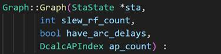

其中slew_rf_count指slew的数量。在电路中，slew一般指信号边缘的上升（rising）或下降（falling）的边缘速度。在OpenSTA中，slew用于特指某引脚的上升或下降时间（rise/fall time）。报告的延迟测量的延迟值除以从电路库中获取的延迟减小比例，并且需要在规定的阈值范围内，有上限和下线限。slew_rf_count的范围为0，1或2，其中0指当前Pin没有任何上升或下降时间信息；1指只有上升时间或下降时间其中一个的信息；2指上升时间和下降时间信息都存在。Slew的记录单位是秒，并且域标准库中的slew相对应。

​    Have_arc_delays是一个布尔值，用于表示图内是否存在弧延迟信息。Ap_count指电路中分析点的数量，这实际是一个int整型变量。ap指分析点analysis point，即评估电路性能和时序特性的特定点。分析点的类型可以为时钟到达点，用于测量时钟信号到达某个特定触发器或寄存器的时间以评估时钟同步性和时序一致性；数据到达点，用于测量数据信号到达某个寄存器的时间，通常与时钟到达点结合使用，以评估数据的稳定性；输出到达点，用于测量输出信号的到达时间，以确保输出在正确的时间内完成；分析路径点，用于评估电路中的时序路径，通常用于查找最长路径，确定电路的最大工作频率等。

在OpenSTA中，将元件的时序信息填充到图（graph）中的主要过程通常涉及到Liberty文件的解析、图的构建，以及时序弧（timing arc）的创建。首先Liberty文件解析就是刚才2.3中所描述的，在解析完库文件后，会进行图的构建。在OpenSTA中，图（graph）用于表示电路的结构和时序信息。Graph构建的过程通常包括遍历电路网表，创建顶点（vertices）和弧（arcs）等。一个电路对应一个Graph类。Graph内的edge分别对应电路的一条路径，vertex分别对应电路的一个引脚Pin。Graph的类函数提供了创建和删除Graph中的边和顶点的手段，将在逐步创建和删除Graph内的边和顶点的过程中，图中的edge与电路的路径，图中的vertex和电路的pin引脚一一对应，一个完整的电路就变成了数据结构层面的模型。图的构建过程通常由Graph::makeGraph()函数负责。

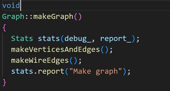

要注意的是，sta中的pin。pin指电子元器件的连接点，分单向pin和双向pin。双向意味该节点可以同时作为输入和输出端口，具有双向传输能力。在时序分析和数字电路设计中，双向节点需要特殊的考虑，因为它们可能在不同时间被用作输入或输出，而且传播延迟通常不同于常规的单向节点。而单向结点只能作为输入或输出，朝单一方向传递信号。双向pin还需要额外考虑驱动和负载之分。双向驱动结点可以控制信号的传输方向。在 Graph类创建vertex的过程完成pin到vertex的绑定。电路中一个pin在Graph中对应一个vertex，所有的vertex都存放在Graph内的集合vertices_中。如果该pin是双向，则Graph提供了一个额外存放双向驱动vertex的集合pin_bidirect_drvr_vertex_。

其中makeVerticesAndEdges()函数为每个引脚创建顶点，这里遍历的是实例和顶层端口引脚，用于预防即使在网络中未明确连接的情况下，也能考虑到所有引脚。

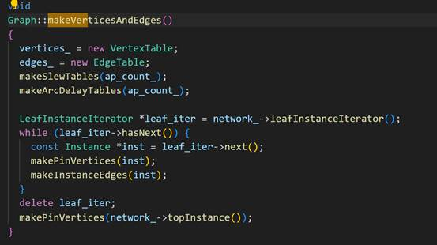

使用network_->leafInstanceIterator()获取叶子实例的迭代器，并遍历这些实例。对于每个实例（inst），调用makePinVertices创建与实例引脚相关的顶点。调用makeInstanceEdges为这些实例创建边。一旦处理完所有叶子实例，方法会对网络中的顶层实例（通常代表整个电路或模块）调用makePinVertices，以确保顶层引脚也被包含在图中。

接下来调用了makeWiresEdges()函数，为电路中每个实例创建线边。

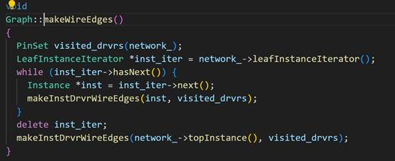

仍然首先使用LeafInstanceIterator遍历电路中的所有叶子实例。对于每个叶子实例，调用makeInstDrvrWireEdges方法来创建从该实例的驱动器引脚到其他引脚的线边。完成所有叶子实例的处理后，再对顶层实例（network_->topInstance()）执行相同的操作。这样就构建了电路图中反映物理连接的边缘结构。

​    关于更底层的makeVertex的函数实现，这一部分的解析在陈洁瑶和陈钰洁的期中报告中已经讲得非常详尽了，这也不是本报告的侧重点。

#### 2.4.2 时序信息的填充

在图构建完成后，就要进行时序弧的创建，这些时序弧描述了不同元件之间的时序关系。时序弧的创建通常要先识别时序路径上的各个元件，根据Liberty文件中的时序信息计算延迟等，创建时序弧，将其与相应的顶点连接。时序弧用于表示信号从一个逻辑元素（如门、寄存器等）传播到另一个逻辑元素的时序特性，包括传播延迟、时序敏感性（时序关系的方向，如时序关系是正向还是负向）等。时序弧包含了描述信号传播的关键信息，这对于时序分析非常重要。在时序分析中，使用这些时序弧的信息来计算电路中各个信号的到达时间（arrival time）、出发时间（required time）等，从而评估电路的时序性能。这些信息有助于确保电路在不同工作条件下都能满足时序要求。

时序弧信息的创建在LibertyParser.cc文件中的makeTimingArcs内， 在这段代码中，函数 makeTimingArcs 用于根据 Liberty文件中的时序信息创建时序弧。关键的步骤包括：获取相关的输出端口（related_out_port），检查时序类型（TimingType），如果是组合逻辑与输入端口的关系，输出警告，处理可能存在的多个相关端口，遍历它们并创建相应的时序弧。

其用于创建时序弧的具体实现是由如下代码实现的

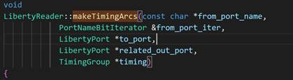

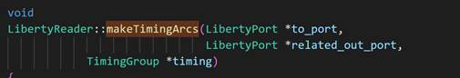

这段代码是OpenSTA中用于创建时序弧的实现。主要目的是根据给定的时序信息（`TimingGroup`）和端口信息（`LibertyPort`）生成相应的时序弧。

 `makeTimingArcs` 函数处理了不同情况下的时序弧创建：单端口到单端口的情况、 总线到单端口的情况、单端口到总线的情况、总线到总线的情况。对于一对一映射和多对多映射，代码通过遍历输入和输出端口的位来创建相应的时序弧。对于每个时序弧的创建，都调用了 `builder_.makeTimingArcs` 方法。

第二个函数 `makeTimingArcs` 处理了目标端口为总线的情况，遍历每个位并创建相应的时序弧。

创建了时序弧，现在关键问题就到了如何将对应的时序信息填入时序弧内，如何将对应的时序信息填入到graph中，在graph.cc文件中，

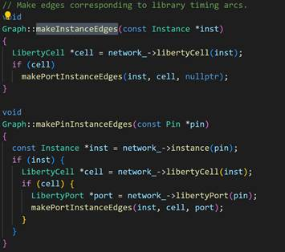

其中

void

Graph::makeArcDelayTables(DcalcAPIndex ap_count)

void

Graph::makeEdgeArcDelays(Edge *edge)

ArcDelay

Graph::arcDelay(const Edge *edge,

  const TimingArc *arc,

  DcalcAPIndex ap_index) const

void

Graph::setArcDelay(Edge *edge,

​    const TimingArc *arc,

​    DcalcAPIndex ap_index,

​    ArcDelay delay)

makeEdgeArcDelays是初始化弧延迟，并为每个时刻节点、每个时序弧设置默认的零延迟。这些延迟在后续的计算和分析中可能会被更新。arcDelay这段代码的目的是获取特定弧的延迟。如果存在弧延迟，则从相应的延迟表格和数组中获取；否则，返回默认的零延迟。

两个函数共同负责设置和获取弧延迟信息。setArcDelay 用于设置特定弧的延迟值，而 wireArcDelay 用于获取特定弧上升/下降沿的延迟。这些操作在时序分析中是关键的，以便模拟电路的时序行为。

在期中相关同学关于OpenSTA的汇报中提到了OpenSTA中有三种Delay的计算方式，分别是标准DSTA（即不将延迟考虑为随机分布），路径延迟是确定的数值和两种SSTA，但OpenSTA中并未完整的支持SSTA相关的分析，并且所预留的相关函数接口也非常简单，因此我想基于OpenSTA自己进行开发一个SSTA工具。首先我想利用OpenSTA工具来进行随机分布的拟合，因此我修改了setArcDelay和setWireArcDelay，将延时修改为一个符合高斯分布的随机量：

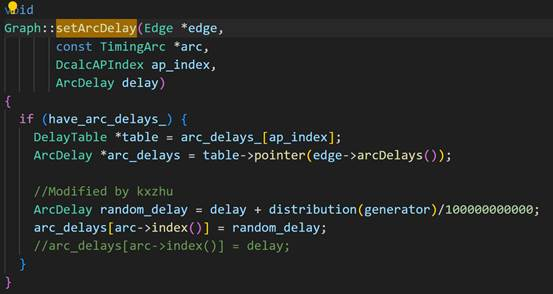

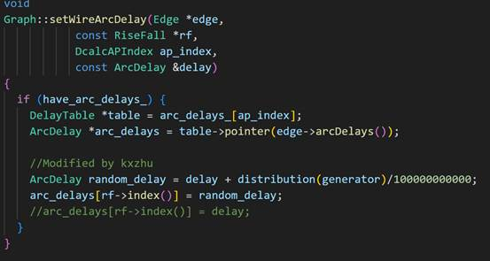

具体函数拟合结构将在后面进行讨论。

 

 

 

 

## 2.4 dcalc

​    创建好时序图并将时序信息填入其中后既要涉及到如何进行图形延时计算，

图形通过图形延迟计算器和SDF阅读器用弧延迟值和波动（也称为过渡时间）进行标注。GraphDelayCalc类从SDC约束中引入波动和到达时间，并使用广度优先搜索访问每个门输出引脚。然后GraphDelayCalc为每个时序弧调用一个时序弧延迟计算器，并标注图形弧延迟和顶点波动。

延迟计算器支持多个延迟计算结果。每个结果都有一个与之关联的延迟计算分析点（DcalcAnalysisPt类），该点指定用于查找延迟的操作条件和寄生参数。ArcDelayCalc类定义了GraphDelayCalc用于计算门延迟、驱动波动、负载延迟和由时序弧驱动的负载波动的API。在dcalc目录中定义了以下延迟计算算法：

UnitDelayCalc - 所有门延迟为1。线延迟为零。

LumpedCapArcDelayCalc - 使用集总电容负载（RSPF pi模型总电容）的Liberty表格模型。线延迟为零。

SimpleRCArcDelayCalc - 使用集总电容负载（RSPF pi模型总电容）的Liberty表格模型。线延迟为RSPF Elmore延迟。

DmpCeffElmoreDelayCalc - RSPF（带Elmore互连延迟的驱动Pi模型）延迟计算器。使用有效电容模型的Liberty表格模型。

DmpCeffTwoPoleDelayCalc - 驱动Pi模型，带两极互连延迟和DmpCeffElmoreDelayCalc中的有效电容。

通过基于ArcDelayCalc定义一个类并使用registerDelayCalc函数为"set_delay_calculator" Tcl命令注册它，可以接口其他延迟计算器。Sta::setArcDelayCalc函数可用于运行时设置延迟计算器。

 

## 2.5 Search搜索算法

OpenSTA使用了广度优先前向搜索来找到图顶点的到达时间。顶点通过Event类的实例标注，以记录信号的到达和所需时间。在前向搜索中访问每个顶点时，如果顶点受到建立或保持时序检查、最小/最大路径延迟异常或门控时序检查的约束，则其所需时间从SDC中找到。松弛是顶点所需时间与到达时间之间的差异。如果顶点受到约束，则将其安排进行广度优先后向搜索，以将所需时间传播到输入顶点。每个时钟边沿和引起顶点变化的异常集合分别使用不同的事件（因此有不同的到达和所需时间）。到达、所需和松弛计算使用基于层级的“懒惰评估”算法增量进行。第一次为顶点找到到达/所需时间时，将到达/所需时间传播到/从顶点的逻辑层级。此后，当请求到达/所需时间时，不需要为任何逻辑层级较低/较高的顶点进行搜索。

时钟到达时间通过Search::findClkArrivals()在数据到达时间之前找到。时钟到达时间现在包括插入延迟（源延迟）。当进行增量网表更改时（例如，通过swap_cell改变门的驱动强度），STA增量更新延迟计算、到达时间、所需时间和松弛。由于门延迟只与波动（过渡时间）弱相关，变化的影响将在变化下游的门中减弱。STA使用对门延迟的容忍度来确定何时停止传播变化。使用Sta::setIncrementalDelayTolerance函数设置容忍度。容忍度是延迟变化的百分比（0.0:1.0），导致在增量延迟计算期间重新计算下游延迟。默认值为0.0，以获得最大精度和最慢的增量速度。当门延迟的变化小于容忍度时，延迟计算不会重新计算下游门的延迟。所需时间必须从任何门延迟变化向后重新计算，因此增加容忍度可以显著减少增量时序运行时间。

 

## 2.6 Tcl接口

从Tcl到C++的接口是在SWIG（www.swig.org）接口描述（tcl/StaTcl.i）中编写的。SWIG根据描述文件生成接口代码。所有用户界面代码都用Tcl编写。SDC参数解析和检查通过调用SWIG接口函数的Tcl过程完成。所有报告命令都用Tcl编写，因此可以轻松定制。Tcl的'sta'命名空间用于将内部STA函数与全局Tcl命名空间隔离。所有用户可见的STA和SDC命令都导出到全局Tcl命名空间。Tcl中可以访问很多内部STA状态，以便更容易进行调试。

此外，许多STA网络和图形对象本身也通过SWIG暴露给了Tcl。这些Tcl对象拥有用于检查它们的方法。如何使用这些方法的示例可以在`tcl/Graph.tcl`和`tcl/Network.tcl`文件中找到。这意味着用户可以通过Tcl脚本直接与STA的网络和图形数据结构进行交互，从而便于分析和调试电路设计。

 

# 3 使用OpenSTA进行SSTA数据拟合

​    在第二节中我提到了，OpenSTA所自带的SSTA存在诸多问题，包括取max操作过于简单，没有支持除Gaussian分布以外的其他概率分布函数，针对这些问题我希望借助OpenSTA标准DSTA模式，在延时分布上加入一个基于Gaussian分布的偏移量，来验证最终得到的关键路径延时是否符合期待的概率分布。

​    在静态时序分析中很重要的一个步骤是取max操作，如果每一个器件都有一个基于Gaussian分布的概率函数延时，在max操作中，会对Gaussian分布的延时引入非线性，导致最终的关键路径延时存在一个偏移量。可以使用基于GEV的概率分布来拟合最终得到的关键路径延时，其中的Gumbel模型还是一个线性模型，这样就可以利用它来进行Clock Skew Scheduling等时需优化操作。针对使用OpenSTA所得到的延时信息，我使用python进行了拟合操作，尝试了多种拟合函数库，包括scipy库，skit-extremes库等，同时使用了ThreadPoolExecutor来并行加速python的执行速度。最终所得到的结果如图所示，可以看见拟合的结果还是非常好的。

不同分布方式的拟合：

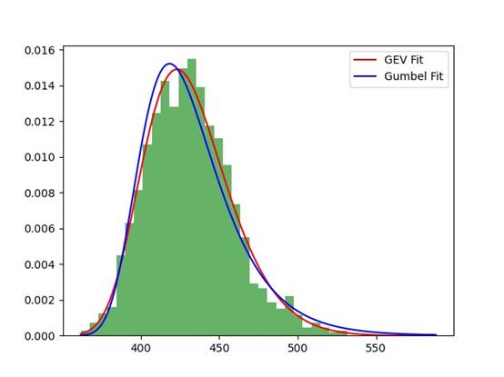

​    下一步工作计划是针对更加复杂更大benchmark进行测试，同时clock skew scheduling需要获得所有路径的max delay和min delay，针对min delay所经过的逻辑门和线的数量不够多的情况下是否能仍然按照GEV分布来进行拟合也需要再测试。

对于maxPathDelay和MinPathDelay的拟合

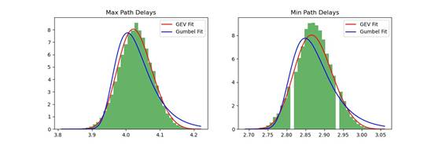

使用不同拟合方法（Mle，Mom，Lmom）的曲线：

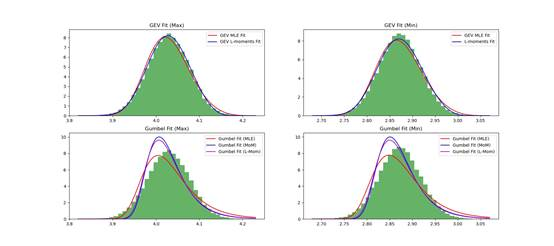

 

# 4 开源EDA社区建设

​    在我看OpenSTA工具的SSTA模块时，发现修改了编译选项来修改为SSTA模式，但最终的结果仍然时DSTA，我在Github寻求帮助，发现了这样的对话：

我认为开源EDA最重要的优点就是有大量的社区维护和共同开发者，这也是促进EDA不断发展的重要因素之一，但这位作者的态度让我觉得他并不想让自己所开发的工具更加完善，态度也十分不友好，开源项目中重要的不仅仅是代码，还涉及社区和相互尊重。

​    于此形成鲜明对比的是OpenTimer，OpenTimer也是一个开源的STA工具，但相比于OpenSTA来说，OpenTimer的功能不是很完善丰富，但OpenTimer的社区维护做的很棒，开发者非常热情，这也给两个工具的使用体验带来了很大的差别。OpenSTA的使用手册开发的很完善，并且它可以很好地与其他EDA工具进行集成，例如布局和布线工具，以自动化整个设计流程，他所预留的接口非常好，是整个项目能够灵活的构建，这也是在编程开发中需要十分重视的地方。

​    